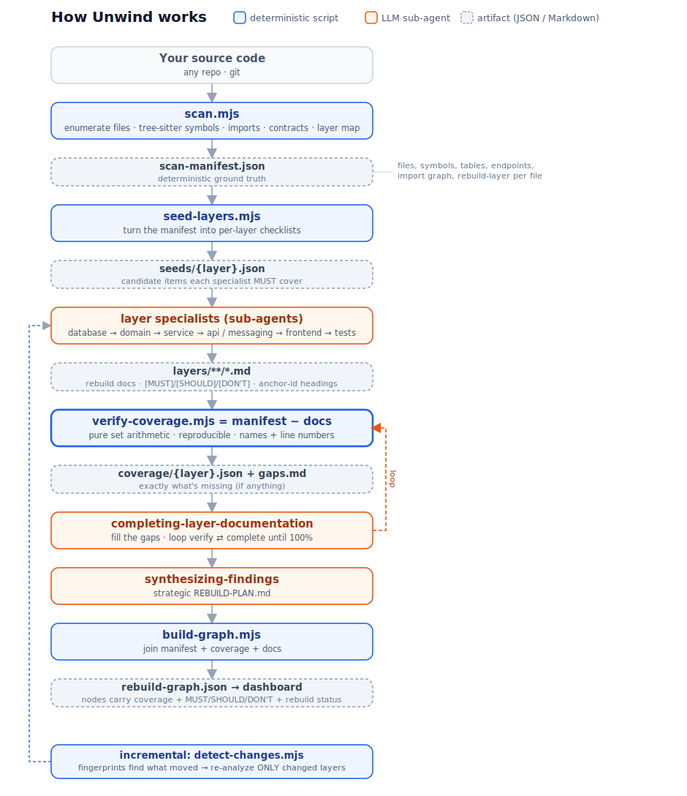

# Unwind

Skills library for reverse engineering codebases. Produces complete, machine-readable documentation and phased rebuild plans to reliably re-build the service or application in a new technology or modernised framework.

## Purpose

Generate documentation that enables an AI agent to rebuild your system in a different language or framework while maintaining:
- External API contract compatibility
- Business logic accuracy
- Data model integrity

Unwind is **hybrid**: a deterministic scanner (`@unwind/core`, built on
tree-sitter) produces the verifiable ground truth — file inventory, structural
symbols, import graph, and a first-pass layer assignment — and LLM specialists add
the semantic rebuild documentation. Completeness is then **verified by set
arithmetic** (`scan − docs`), not asserted. Symbol extraction supports
TypeScript/JavaScript, Python, Rust, Java, and C#; other languages get file-level
coverage, and if Node/pnpm is unavailable Unwind falls back to a pure-LLM flow.

It can also **execute the rebuild**: `uw-build` interviews you about scope and
order, dispatches technology-agnostic builder agents that reproduce each layer's
`[MUST]` contracts in the target stack, then **re-scans the rebuilt repo and diffs
it against the source** to measure completeness — a before/after picture, again by
set arithmetic rather than assertion.

## Quick Start

### Install

```
/plugin marketplace add cliftonc/unwind
/plugin install unwind@cliftonc
```
Restart Claude Code after installation.

### Use

**New here? Just run the entry point:**
```
Use unwind:uw-start   # orients you, checks prereqs, drives the whole pipeline
```

Or run the phases manually:
```
1. Use unwind:uw-scan              # deterministic scan → architecture.md (+ scan-manifest.json)
2. Use unwind:uw-dashboard   # visualize it — works straight after the scan
3. Review docs/unwind/architecture.md
4. Use unwind:uw-analyze # seed → analyze → verify coverage → complete
5. Use unwind:uw-plan   # → REBUILD-PLAN.md
6. Use unwind:uw-dashboard   # re-open to explore coverage, priorities & contracts
7. Use unwind:uw-build   # execute the rebuild in the target stack (+ verification graph)
```

You can run **`unwind:uw-dashboard` any time after step 1** — right after the
scan it shows the structural graph (everything `scanned`); after analysis it fills
in coverage and the MUST/SHOULD/DON'T priorities.

The first run builds the scanner automatically (`pnpm install && pnpm build` via
`ensure_unwind_core`). It needs Node + pnpm; without them, Unwind falls back to a
pure-LLM flow.

**Output:**
- `docs/unwind/REBUILD-PLAN.md` - Strategic rebuild approach
- `docs/unwind/layers/*/` - Detailed layer analysis (folder per layer)
- `docs/unwind/rebuild-graph.json` - Knowledge graph for the dashboard
- `docs/unwind/rebuild-verification-graph.json` - Source→target completeness (after `uw-build`)
- `docs/unwind/.cache/` - Deterministic artifacts: `scan-manifest.json` (ground truth), `seeds/` (per-layer checklists), `coverage/` (per-layer coverage reports), `rebuild-state.json` (rebuild ledger)

---

### Updating

```
/plugin marketplace update cliftonc
/plugin uninstall unwind
/plugin install unwind@cliftonc
```

---

## How it works

Unwind interleaves **deterministic scripts** (which own the verifiable facts) with
**LLM sub-agents** (which add semantic judgment). The deterministic layer is what
makes "did we document everything?" a *checkable* question instead of a hopeful one.



### Step by step

| # | Step | Kind | What it does |
|---|------|------|--------------|
| 1 | `scan.mjs` | **deterministic** | Walks `git ls-files`, runs tree-sitter to extract symbols (functions, classes, **tables, endpoints**), resolves the import graph, and assigns every file a rebuild layer → **`scan-manifest.json`**, the ground truth. |
| 2 | `seed-layers.mjs` | **deterministic** | Turns the manifest into a per-layer **candidate checklist** (`seeds/{layer}.json`) — the exact set of items each specialist must cover. |
| 3 | layer specialists | LLM | Sub-agents document each layer (database → domain → service → api/messaging → frontend → tests), seeded with their checklist, writing tagged docs with `### name [MUST] <!-- id: ... -->` anchor headings. |
| 4 | `verify-coverage.mjs` | **deterministic** | The key move: **`manifest − docs`** by set arithmetic. Anything in the scan but not in the docs is a gap — reported with names and line numbers in `gaps.md`. Reproducible byte-for-byte. |
| 5 | `uw-complete` | LLM | Fills the `gaps.md` work list. Loops 4 ⇄ 5 until coverage is 100% (or items are explicitly excluded). |
| 6 | `uw-plan` | LLM | Produces the strategic **`REBUILD-PLAN.md`** (re-use decisions, phasing, validation). |
| 7 | `build-graph.mjs` | **deterministic** | Joins manifest + coverage + docs into **`rebuild-graph.json`** — nodes carry MUST/SHOULD/DON'T, coverage state, and rebuild status — and powers the dashboard. |
| 8 | `uw-build` + `uw-build-layer` | LLM | **Executes** the rebuild: per-slice builder sub-agents reproduce each layer's `[MUST]` contracts in the target stack and record a source→target map. Holds progress in `rebuild-state.json`; can loop until verified (`/loop /uw-build`). |
| 9 | `merge-rebuild-map.mjs` + `verify-rebuild.mjs` | **deterministic** | Folds the per-slice maps into `rebuild-state.json`, then **re-scans the target repo** and diffs it against the source graph (endpoint method+path; table+field names) → **`rebuild-verification-graph.json`** + `rebuild-gaps.md`. Completeness over `[MUST]`, measured not asserted. |
| ↻ | `detect-changes.mjs` | **deterministic** | After code changes, structural fingerprints find exactly what moved so only the **affected layers** are re-analyzed; changed contracts are flagged `stale` / `needs-recheck` (and built nodes whose source moved are re-queued for rebuild). |

**Why it matters:** completeness ("all 42 tables") used to be the LLM's word for it.
Now the scanner finds the 42, the specialist documents them, and step 4 *proves*
none are missing. Languages with tree-sitter symbol extraction: TypeScript/JavaScript,
Python, Rust, Java, C#. Other languages get file-level coverage; with no Node/pnpm,
Unwind falls back to a pure-LLM flow.

## Visualize the graph

Live demo: [unwind.cliftonc.nl](https://unwind.cliftonc.nl)

After a run, explore your own result interactively:

```
Use unwind:uw-graph   # build docs/unwind/rebuild-graph.json
Use unwind:uw-dashboard         # launch the React + React Flow dashboard
```

The dashboard (`http://127.0.0.1:5174`) shows the dependency-ordered layers, a
per-layer **coverage meter**, the **MUST/SHOULD/DON'T** breakdown, and a filterable
**contract inventory** (every table, endpoint, …) with source links and rebuild
status. To point it at any project directly:

```
UNWIND_GRAPH_DIR="/path/to/project" pnpm --filter @unwind/dashboard dev
```

## Execute the rebuild

Once the plan exists, `uw-build` actually rebuilds the system in the target stack:

```
Use unwind:uw-build      # interview (scope/order/target) → build → verify
/loop /uw-build          # ...or run it under /loop: build until completeness hits target
```

What it does:

1. **Interviews you** (grilling-style, grounded in `REBUILD-PLAN.md`) for the few
   decisions the plan doesn't already fix: scope (one slice / one phase / whole),
   where the rebuilt code lives, verification depth, and execution mode. It skips
   anything the plan already answers.
2. **Dispatches builder agents** per slice. They are **technology-agnostic** but held
   to functional equivalence (see `skills/rebuild-principles.md`): the external API
   surface, the data model, and the business rules must behave the same — it is *not*
   a line-by-line port. Each builder records a source→target map.
3. **Measures completeness.** The target repo is re-scanned and diffed against the
   source graph by the same set-arithmetic machinery: endpoints match on
   method+path, tables on field names (across snake_case/camelCase, `:id`↔`{id}`,
   etc.). Each source item becomes `equivalent`, `present`, `divergent`, `claimed`,
   or `missing` → **`rebuild-verification-graph.json`** + a `rebuild-gaps.md` work
   list, and the dashboard lights up via `rebuild-progress.json`.

Progress is durable in `docs/unwind/.cache/rebuild-state.json`, so a build can be
paused and resumed, run slice-by-slice, or looped unattended — the loop terminates
on the **measured** completeness number, not a guess.

> **Honest by design:** `present` means the symbol exists; it does **not** prove
> behavior. The deterministic diff covers the routing surface and data-model shape —
> field types, payload bodies, and business rules need the project's tests
> (run-tests verification depth), not the graph.

## Keeping it fresh (incremental)

```
Use unwind:uw-refresh      # after code changes
```

`scan.mjs` records a fingerprint baseline (`meta.json`). `detect-changes.mjs` diffs
a fresh scan against it and classifies every file as `structural` (signature moved),
`cosmetic` (body/comments only — docs stay valid), `added`, `removed`, or
`unchanged`. Only the layers in `affectedLayers` are re-analyzed, and documented
items whose source changed structurally are marked `stale` in the graph — so the
unwind spec stays accurate across a long migration instead of going out of date.

---

## Principles

All analysis follows these principles (see `skills/analysis-principles.md`):

| Principle | Description |
|-----------|-------------|
| **Completeness** | Document ALL items - counts come from the scan manifest and are verified |
| **Manifest seeding** | Specialists receive a candidate checklist; cover every item, exclusions documented not dropped |
| **Anchor-id headings** | `### name [MUST] <!-- id: ... -->` so coverage is checked mechanically |
| **Machine-readable** | Actual code, SQL, mermaid - not prose summaries |
| **Link to source** | Uses repo info for GitHub links, or local paths |
| **No commentary** | Facts only, no speculation or recommendations |
| **Rebuild categorization** | Tag items as MUST/SHOULD/DON'T keep |
| **Incremental writes** | Write each section immediately, don't buffer |
| **Migrations: current state** | Document final schema, not migration history |

## Skills

### Core Flow

| Skill | Purpose | Output |
|-------|---------|--------|
| `uw-scan` | Deterministic scan + discovery | `architecture.md` (+ `scan-manifest.json`) |
| `uw-analyze` | Orchestrates seed → analyze → verify → complete | Dispatches specialists |
| `uw-verify` | Deterministic `manifest − docs` diff | `gaps.md` per layer |
| `uw-complete` | Fixes all gaps | Updated layer files |
| `uw-plan` | Generates strategic rebuild plan | `REBUILD-PLAN.md` |
| `uw-graph` | Joins manifest + coverage + docs | `rebuild-graph.json` |
| `uw-dashboard` | Launches the interactive graph UI | dashboard at `:5174` |
| `uw-build` | Executes the rebuild in the target stack + measures completeness | rebuilt code + `rebuild-verification-graph.json` |
| `uw-build-layer` | Per-slice technology-agnostic builder (dispatched by `uw-build`) | target code + source→target map |
| `uw-refresh` | Incremental update (only changed layers) | refreshed docs + graph |

### Layer Specialists

| Skill | Analyzes | Key Requirements |
|-------|----------|------------------|
| `uw-analyze-database` | Schema, repositories | All tables, JSONB schemas, indexes |
| `uw-analyze-domain` | Entities, validation | Constraint tables, permission matrix |
| `uw-analyze-service` | Services, calculations | Formulas with source refs, edge cases |
| `uw-analyze-api` | Endpoints, auth, contracts | OpenAPI/TSRest specs, route inventory |
| `uw-analyze-messaging` | Events, queues | AsyncAPI specs, event schemas |
| `uw-analyze-frontend` | Components, state | User flows (WHAT), not implementation (HOW) |

### Testing Specialists

| Skill | Analyzes |
|-------|----------|
| `uw-analyze-unit-tests` | Unit test coverage and patterns |
| `uw-analyze-integration-tests` | Integration test infrastructure |
| `uw-analyze-e2e-tests` | E2E tests and page objects |

## Output Structure

```
docs/unwind/
├── architecture.md                    # Layer detection, tech stack, repo info (derived from scan)
├── rebuild-graph.json                 # Knowledge graph for the dashboard
├── rebuild-verification-graph.json    # Source→target completeness (after uw-build)
├── rebuild-gaps.md                    # MUST items not yet present/equivalent (after uw-build)
├── .cache/                            # Deterministic artifacts
│   ├── scan-manifest.json            # Ground truth: inventory, symbols, contracts, import graph
│   ├── meta.json                     # Fingerprint baseline (incremental refresh)
│   ├── changes.json                  # detect-changes output (incremental refresh)
│   ├── seeds/{layer}.json            # Per-layer candidate checklists
│   ├── coverage/{layer}.json         # Per-layer coverage reports
│   ├── rebuild-state.json            # Rebuild ledger: per-node status + source→target map
│   ├── rebuild-map/{slice}.json      # Per-slice mappings written by builder agents
│   ├── rebuild-progress.json         # Rebuild-status overlay the dashboard renders
│   └── target-scan/                  # Isolated scan of the rebuilt target repo
├── layers/
│   ├── database/
│   │   ├── index.md                   # Overview, links to sections
│   │   ├── schema.md                  # All tables, fields
│   │   ├── repositories.md            # Data access patterns
│   │   └── jsonb-schemas.md           # Complex field structures
│   ├── domain-model/
│   │   ├── index.md
│   │   ├── entities.md
│   │   ├── enums.md
│   │   └── validation.md
│   ├── service-layer/
│   │   ├── index.md
│   │   ├── services.md
│   │   ├── formulas.md                # Business calculations [MUST]
│   │   └── dtos.md
│   ├── api/
│   │   ├── index.md
│   │   ├── endpoints.md
│   │   ├── contracts.md               # OpenAPI/TSRest [CRITICAL]
│   │   └── auth.md
│   ├── frontend/
│   │   ├── index.md
│   │   ├── pages.md                   # User flows, not React code
│   │   └── state.md
│   └── [test layers...]
└── REBUILD-PLAN.md                    # Strategic rebuild approach
```

## Rebuild Plan

The `REBUILD-PLAN.md` provides:

1. **External Contract Compatibility** - OpenAPI/AsyncAPI specs that MUST be preserved
2. **Phased Approach** - Database → Domain → Services → API → Frontend
3. **Validation Checkpoints** - Concrete tests for each phase
4. **Migration Strategy** - Data migration and parallel running approach

## Rebuild Categorization

Each documented item is tagged:

| Tag | Meaning | Action |
|-----|---------|--------|
| **MUST** | Essential for comparable functionality | Implement exactly |
| **SHOULD** | Valuable but implementation-flexible | Preserve intent |
| **DON'T** | Tech-stack specific | Omit from rebuild |

## License

MIT
