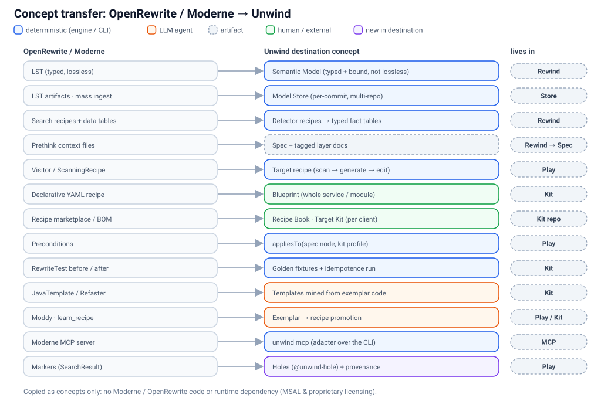

# 01 · Review: OpenRewrite / Moderne compared with Unwind

> **In short:** OpenRewrite's Lossless Semantic Tree and its recipe model are the best existing answer to "deterministic, verifiable code change at scale", and almost every concept is worth adopting. But OpenRewrite only transforms code *within* one language, and its non-JVM languages and most recipe packs are source-available or proprietary. Unwind therefore **copies the concepts and takes no dependency on the code**.

Research was done on 2026-10-07 from primary sources: the `openrewrite/rewrite` monorepo, docs.openrewrite.org, docs.moderne.io and moderne.ai. Items we could not confirm are marked **[unverified]**.

## 1.1 What the LST is

A **Lossless Semantic Tree (LST)** is "a tree representation of code" that adds two things a classic AST lacks: **type attribution** and **format preservation** ([docs: LSTs](https://docs.openrewrite.org/concepts-and-explanations/lossless-semantic-trees), [moderne.ai/platform/lst](https://moderne.ai/platform/lst)).

- **Type attribution.** Every typed node carries a `JavaType` ([docs: type attribution](https://docs.openrewrite.org/reference/type-attribution)). The variants are `Class`, `Parameterized`, `GenericTypeVariable`, `Method`, `Variable`, `Array`, `Primitive` and `Unknown`. Between them they hold the fully-qualified names, supertypes, method signatures, generics and annotations. The same type model is **reused for Kotlin, TypeScript, Python, C# and Go**.
- **Built by the real compiler:** javac for Java, the TypeScript compiler API (`ts.createProgram` + `getTypeChecker()`) for JS/TS, Roslyn for C#. That is why OpenRewrite needs the classpath or dependencies. When it can't resolve them, types fall back to `JavaType.Unknown` and type-gated recipes **silently match nothing** ([FAQ](https://docs.openrewrite.org/reference/faq)).
- **Format preserving.** Whitespace and comments are stored on the nodes, so printing the tree reproduces the source byte-for-byte. Edits pick up the local style.
- **Markers** are immutable metadata attached to any node: search results, provenance, build-tool facts ([docs: markers](https://docs.openrewrite.org/concepts-and-explanations/markers)).
- **Storage.**
  - The OSS Maven/Gradle plugins hold the whole LST **in memory** for one run.
  - The Moderne CLI (`mod build`) uses the build tool only for discovery, parses in its own JVM, and serialises LSTs into JAR artifacts published to Artifactory/Nexus ([how LST artifacts are produced](https://docs.moderne.io/administrator-documentation/moderne-platform/references/how-lst-artifacts-are-produced)). The on-disk format is proprietary **[unverified detail]**.
- **Languages and bridging.** Non-JVM languages run as peers over **JSON-RPC** (`RewriteRpc`). They are implemented in their own language: TypeScript for JS/TS, Python, C# and Go peers.

## 1.2 What a recipe is

| Concept | What it does | Source |
|---|---|---|
| Visitor recipe | `Recipe.getVisitor()` walks the LST and edits nodes | [recipes](https://docs.openrewrite.org/concepts-and-explanations/recipes) |
| `ScanningRecipe<Acc>` | Three phases: **scan** every file into an accumulator, then **generate** new files, then **edit**. Cross-file knowledge only flows through the accumulator | [scanning recipes](https://docs.openrewrite.org/reference/scanning-recipes) |
| Declarative recipe | YAML `recipeList` that composes other recipes with options | docs: types of recipes |
| Refaster / `JavaTemplate` | Before→after templates, compiled into type-attributed snippets | [refaster recipes](https://docs.openrewrite.org/authoring-recipes/refaster-recipes) |
| Preconditions | `Preconditions.check(...)` gates a recipe on facts (e.g. "repo has dependency X") | recipes docs |
| Search recipes + **data tables** | Recipes that *report* instead of edit. They emit `SearchResult` markers and typed rows (CSV) | [data tables](https://docs.openrewrite.org/authoring-recipes/data-tables) |
| Testing | `RewriteTest`: `rewriteRun(java(before, after))`, with type validation after the run and repeated cycles to catch non-idempotent recipes | [recipe testing](https://docs.openrewrite.org/authoring-recipes/recipe-testing) |
| Generation | Only `ScanningRecipe.generate()` creates files (e.g. `CreateTextFile`). All the documented examples are small artifacts, not applications | scanning recipes docs |

Recipes can be authored in **TypeScript** for JS/TS targets: `@openrewrite/rewrite` provides `Recipe`, `JavaScriptVisitor`, and `pattern`/`template` rewrite rules. They still *run* through the Moderne CLI ([writing a JS recipe](https://docs.openrewrite.org/authoring-recipes/writing-a-javascript-refactoring-recipe)).

## 1.3 The Moderne platform around it

- **Moderne CLI (`mod`).** Multi-repo builds and runs. Free for public repositories; private repositories need a licence ([CLI licence](https://docs.moderne.io/user-documentation/moderne-cli/getting-started/moderne-cli-license)).
- **Platform / DX.** Multi-repo LST store, Trigrep search (trigram plus structural), data-table analytics, and coordinated pull requests.
- **AI.**
  - An **MCP server** inside the CLI, with tools like `find_types`, `find_methods`, `run_recipe`, `query_datatable` and `learn_recipe` ([MCP overview](https://docs.moderne.io/user-documentation/agent-tools/mcp/overview/)).
  - The **Moddy** agent, which uses recipes as deterministic tools **[current status unverified]**.
- **Prethink** ([docs](https://docs.moderne.io/user-documentation/agent-tools/prethink)). About 140 recipes that write agent context into `.moderne/context/`: service endpoints, DB connections, DTO schemas, test gaps, code smells and a FINOS CALM architecture model. **This is the nearest analogue to Rewind.**

## 1.4 The two facts that decide our strategy

**1. No cross-language translation.** We found no recipe that translates code between languages: not Java→Kotlin, not JS→TS, not COBOL→Java. Every visitor edits one language's tree and prints it back in that same language. Cross-language work stops at three things:
- multi-file-type recipes (a POM condition driving a YAML edit);
- reading one language as evidence for another;
- framework migrations *within* one language (Spring→Quarkus).

Unwind's core job is to rebuild in a **different stack**. OpenRewrite does not do that.

**2. Licensing and runtime.**

The licensing below is our reading of [OpenRewrite licensing](https://docs.openrewrite.org/licensing/openrewrite-licensing). **It is not legal advice.**

| Layer | Licence |
|---|---|
| `rewrite-core`, Java, Kotlin, Groovy, XML/YAML/JSON/HCL/TOML/Protobuf, Maven/Gradle, `rewrite-templating`, `rewrite-analysis`, `RewriteRpc` | Apache-2.0 |
| JS/TS (`@openrewrite/rewrite`), Python, C#, Go, Ruby, Scala; `rewrite-static-analysis`, `rewrite-spring`, `rewrite-migrate-java`, `rewrite-prethink` … | **MSAL**: may not be commercialised or provided as a managed service |
| `io.moderne.*` recipes, Prethink at scale, data-flow / impact analysis | Proprietary |

In practice, non-JVM languages only run through the JVM host plus the Moderne CLI. That conflicts with Unwind's lightweight Node runtime, its "degrade gracefully" rule, and its OSS (MIT) distribution.

**Decision: no dependency on the Moderne stack, not even interoperability.** We adopt the concepts.

## 1.5 Known limits we must not reproduce

- **Missing types fail silently.** Type-gated logic silently matches nothing when resolution fails. Unwind must instead *report* the tier it reached (§5.2).
- **The whole LST in memory** causes out-of-memory failures on large repos. Unwind keeps facts, not trees, and writes them to disk (§5.5).
- **Noisy whole-file rewrites and huge pull requests** were found too unwieldy to review ([Adyen case study](https://www.adyen.com/knowledge-hub/how-we-automated-code-modernization-with-openrewrite)). Play generates into a *new* target repo slice by slice, with holes clearly marked.
- **Stateful recipes are bug-prone** ([cronn](https://www.cronn.de/en/blog/openrewrite-for-refactoring)). Unwind recipes are pure functions with golden fixtures (§4.3).

## 1.6 Concept transfer

| OpenRewrite / Moderne | Unwind destination concept | Lives in | Doc |
|---|---|---|---|
| LST (typed, lossless) | **Semantic Model**: typed and *bound*, but not lossless. Unwind never edits the source, so format preservation is not needed | Rewind | [05](05-semantic-model.md) |
| LST artifacts, mass ingest | **Model Store**: per-commit, versioned, multi-repo queries | Store | [05](05-semantic-model.md) |
| Search recipe + data tables | **Detector recipes** emitting typed fact tables | Rewind | [05](05-semantic-model.md) |
| Prethink context | **Spec** plus tagged layer docs | Rewind → Spec | [02](02-architecture.md) |
| Visitor / `ScanningRecipe` | **Target recipe**: scan Spec → generate → edit | Play | [04](04-target-kits-and-recipes.md) |
| Declarative YAML recipe | **Blueprint**: a whole service or module | Kit | [04](04-target-kits-and-recipes.md) |
| Recipe marketplace / BOM | **Target Kit / Recipe Book**: versioned per client | Kit repo | [04](04-target-kits-and-recipes.md) |
| Preconditions | `appliesTo(specNode, profile)` | Play | [04](04-target-kits-and-recipes.md) |
| `RewriteTest` before/after | **Golden fixtures** (Spec fragment → expected files) plus an idempotence run | Kit | [04](04-target-kits-and-recipes.md) |
| `JavaTemplate` / Refaster | Parameterised templates **mined from exemplar code** | Kit | [04](04-target-kits-and-recipes.md) |
| Moddy / `learn_recipe` | **Exemplar → recipe promotion** | Play | [04](04-target-kits-and-recipes.md) |
| Moderne MCP | `unwind mcp`: a thin adapter over the CLI | Surfaces | [02](02-architecture.md) |
| `SearchResult` markers | **Holes** (`@unwind-hole`) and provenance markers | Play | [04](04-target-kits-and-recipes.md) |

## 1.7 What stays uniquely Unwind

- **`[MUST]` / `[SHOULD]` / `[DON'T]` tagging** of every documented item, with rationale.
- **Completeness proven by set arithmetic** (`scan − docs`, `Spec − target`), never asserted.
- **Grilling plus domain-expert verdicts**, which decide whether a behaviour *deserves* to be reproduced.
- **Cross-stack rebuild with verification**, which OpenRewrite does not attempt.
- New in this design: **behaviour parity against the legacy app** ([06](06-behaviour-parity.md)) and **context-gap interviews** ([07](07-context-gaps.md)).
