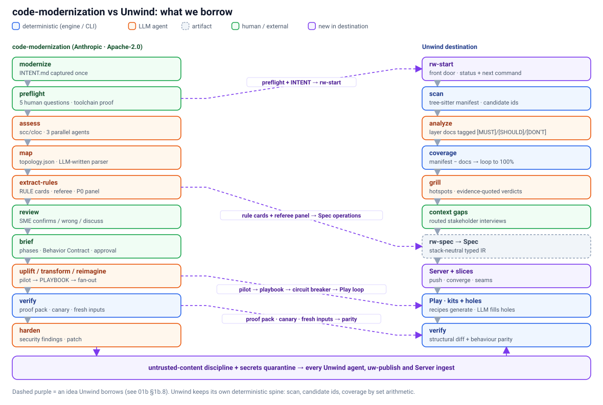

# 01b · Comparison: Anthropic's code-modernization plugin

> **In short:** [`code-modernization`](https://github.com/anthropics/claude-plugins-official/tree/main/plugins/code-modernization) is the closest prior art to Unwind: a Claude Code plugin for modernizing legacy systems. It is strongest where Unwind is weakest. It *proves* behaviour with careful deterministic engineering and puts adversarial review on every extracted rule. It is weakest where Unwind is strongest: it has no AST ground truth, no completeness proven by set arithmetic, and no structural contract diff. The two complement each other rather than compete. This doc compares them and lists 17 ideas to borrow, with where each one lands in our design.

Source: plugin v1.0.0 in `anthropics/claude-plugins-official`, read file by file (commands, agents, hooks, workflow scripts; the Python scripts were read at docstring level), and none of it was executed. **License: Apache-2.0** (the vendored mermaid is MIT).

## 1b.1 What it is

"Guided modernization for any legacy codebase … with independent proof that the new code behaves like the old" (`plugin.json`). It has one front door (`/code-modernization:modernize`) and four tracks:

| Track | What it does | Example targets |
|---|---|---|
| **understand** | assessment, map, rules and a plan, with no build | any |
| **uplift** | same stack, newer version | .NET Framework → .NET 8, Java 8 → 17, Spring Boot 2 → 3, Py2 → 3 |
| **transform** | cross-stack rewrite, one module at a time (strangler fig) | COBOL → Java, PHP → FastAPI, AngularJS → React |
| **reimagine** | greenfield rebuild on a new architecture | AI-native service design from the extracted rules |

**COBOL/CICS/JCL are first-class**: copybooks, `EXEC CICS LINK/XCTL`, JCL `DD` joins, fixed-column slicing. The target user is explicitly a **non-expert** ("ask little, explain in plain words"), and the plugin also triages whole portfolios (`assess --portfolio`).

## 1b.2 Pipeline

All output lands in `analysis/<sys>/` and `modernized/`, and the legacy code is symlinked at `legacy/<sys>`.

| # | Command | Main artifacts |
|---|---|---|
| 0 | `modernize` | `INTENT.md`: the goal and "what must stay true", captured once and read by every later command |
| 1 | `preflight` | `PREFLIGHT.md`: five "only a human knows" questions, build smoke tests, a throwaway target project proving the toolchain, missing includes, **scope boundary + inbound blast radius**, and a check that `Edit(/legacy/**)` is denied |
| 2 | `assess` | `ASSESSMENT.md`, `ARCHITECTURE.mmd`, gitignored `SECRETS.local.md`; scc/cloc sizing ("relative scale only, never a timeline"); 3 parallel agents (domains, debt, CWE security); a 6R recommendation |
| 3 | `map` | `topology.json` (domains, modules, call/dispatch/read/write edges, entry points, persona flows) built by an **LLM-written one-off parser** `extract_topology.py`, or imported from jdeps/madge/`cargo metadata`; `TOPOLOGY.html` plus Mermaid diagrams |
| 4 | `extract-rules` | `BUSINESS_RULES.md`: `RULE-NNN` Given/When/Then cards with concrete values, P0/P1/P2, one `file:line`, parameters, edge cases, suspected defect, confidence + SME question; `DATA_OBJECTS.md` |
| 4b | `review` | `RULE_REVIEWS.json/.md`: a person marks flagged rules confirmed / wrong / discuss |
| 5 | `brief` | `MODERNIZATION_BRIEF.md`: C4 target, 3–6 phases in a **machine-parsed shape** (`Command:`, `Modules:`, `Scale:`, `Risk:`, checkbox entry/exit criteria), the **Behavior Contract** (= the P0 rules), and an approval block. **Hard stop until approved.** |
| 6 | `uplift` / `transform` / `reimagine` | see §1b.3 |
| 7 | `verify` | `VERIFICATION.md/.json`: **PROVEN / PARTLY PROVEN / NOT PROVEN** per module, plus a blank sign-off |
| 8 | `harden` | `SECURITY_FINDINGS.md` + a remediation patch that is never auto-applied |
| — | `status` | inventory, staleness by artifact mtime, **the exact next command**, refreshed `REPORT.html` |

**Six human decision points:** preflight answers, rule review, brief approval, accepting each proof difference, signing the proof, and applying the security patch. Brief criteria are "conditions, never states": build commands may tick a box but never reword one, and a change must go on a `Proposed revision:` line. Phase 1 is always a **pilot**, and the brief is "a hypothesis" to regenerate after it.

## 1b.3 The build tracks

- **transform** (per module):
  1. a plan gate;
  2. characterization tests written first by `test-engineer`, each naming its `RULE-NNN` and approved by the user;
  3. an idiomatic rewrite ("do not mirror COBOL paragraphs");
  4. run the tests, "count what ran", run a canary;
  5. a dual-run byte comparison when the legacy system can execute;
  6. `TRANSFORMATION_NOTES.md` mapping legacy `file:line` to target `file:line`, then an architecture-critic pass.
- **uplift:**
  1. a working copy;
  2. `DELTA_CATALOG.md`, built with one finder per category (API removed, *Behavioral-silent*, project system, dependency) and a referee per delta, each tagged Mechanical or Judgment;
  3. `BASELINE.md` with **measured** old-version test results ("Measure it, do not type it");
  4. a mandatory in-session **pilot** that writes `PLAYBOOK.md` ("the most valuable artifact");
  5. a dependency-aware fan-out in escalating batches with a **2/3 build-rate circuit breaker** and re-passable `failedUnits`/`blockedUnits` lists. Playbook gaps are folded back in between batches. "The right response to a failing batch is a better playbook, not more agents."
- **reimagine:**
  1. `AI_NATIVE_SPEC.md` (capabilities, domain model, OpenAPI/AsyncAPI fragments, NFRs, Behavior Contract);
  2. an architecture critique, then parallel scaffolding, one agent per service;
  3. acceptance tests marked expected-failure by rule id;
  4. a `CLAUDE.md` handoff.

## 1b.4 Agents

There are eight agents, all inheriting the session model. Every analysis agent carries the same **untrusted-content discipline**:
- code is data;
- a rule supported only by a comment is not a rule;
- report instruction-shaped text by `file:line`;
- stay read-only;
- mask secrets to a 2–4 character preview.

| Agent | Role |
|---|---|
| `legacy-analyst` | Reads before it greps, cites everything, separates "is" from "appears to be". Also acts as citation referee and consolidator. |
| `business-rules-extractor` | "If a rule would be the same regardless of what language … it's a business rule." Writes Given/When/Then with concrete values (e.g. "$19.27 (balance × APR ÷ 12, rounded half-up)"). |
| `architecture-critic` | Adversarial: flags "microservices-for-the-resume" and "JOBOL" (COBOL-shaped Java), and asks "does the test suite actually pin behavior". |
| `security-auditor` | OWASP/CWE checks; each finding needs a one-sentence exploit scenario or it is downgraded. |
| `test-engineer` | "The legacy code is the oracle." One test per branch arm; "a comparison that cannot run is a failure, never a skip". |
| `version-delta-analyst` | Breaking changes × what this code uses. Drives OpenRewrite, upgrade-assistant and similar tools, distinguishing *present / runnable / actually ran*. |
| `uplift-migrator` | "If `PLAYBOOK.md` does not exist, STOP." Smallest diff, stays inside its own unit, never edits shared files. |
| `scaffolder` | Writes only inside its own service directory, and reports planted text as blockers. |

## 1b.5 Determinism vs LLM

**Analysis is LLM-driven, with no AST.** Structure comes from an LLM-written per-system parser, ecosystem tools, or an imported graph. Sharding is by extension and directory. There is **no symbol inventory and no completeness proof**. Rule completeness is heuristic:
- module shards where every rule must cite a listed file;
- lens rounds that stop on diminishing returns (fewer than 3 new rules, or under 15% new);
- explicit `skippedModules` / `unverifiedRules` / `rerunModules` gap lists;
- a granularity norm (one rule per 40–80 lines).

The README says it plainly: "two runs can find different rules."

**Analysis is adversarially reviewed:**
- a citation referee per rule (confirmed / refuted / wrong citation);
- a **two-judge P0 panel** (compliance lens + fidelity lens), where a split verdict demotes the rule and raises an SME question;
- consolidation keeps the most conservative priority;
- security uses finders, then refuters, then a second judge, and reports dead finders as **coverage gaps**: "a report silent about lost coverage reads as a clean scan".

**Verification is deterministic, and that is the real strength** (stdlib Python, hardened against hostile input):
- **`compare.py`**: byte comparison with declared masks (each needs a `why`), numeric tolerance (refuses anything looser than 1% relative / 1e-6 absolute), and human `approvedDifference`/`approvedInputs` with reasons. It also runs a **self-check that flips bytes to prove the comparator can detect a difference**.
- **`proof_pack.py`**, six fixed checks:
  1. tests ran, with counts parsed from JUnit/TRX/logs only, never typed, and results newer than the code;
  2. every P0 rule is backed by a test that **ran and passed** (trace states: tested / named-not-run / code-only / claimed-only / none);
  3. development cases are re-judged;
  4. at least 10 **fresh inputs** that development never used;
  5. a canary;
  6. legacy untouched.

  If the legacy system can't run, the ceiling is PARTLY PROVEN.
- **`baseline_diff.py`**: regressions, renamed vs missing tests, drops in executed counts. **`uplift_checks.py`** flags deleted tests, more than 25% of test files changed, and Behavioral-silent deltas no test names.
- Workflows are deterministic orchestration: a journaled `resumeFromRunId`, agent and token budgets, and untrusted text fenced as `<<<UNTRUSTED … UNTRUSTED>>>`.

## 1b.6 Side by side

| Concern | code-modernization | Unwind (today + destination) |
|---|---|---|
| Ground truth | scc/cloc, LLM-written topology parser, directory shards | tree-sitter scan-manifest: symbols, contracts, imports, layers, candidate ids |
| Documentation completeness | heuristic (diminishing returns, gap lists) | **set arithmetic** `manifest − docs`, loop to 100% |
| Business rules | `RULE-NNN` G/W/T cards, P0–P2, referee + two-judge P0 panel | layer docs tagged `[MUST]/[SHOULD]/[DON'T]` with anchor ids; grill with quoted evidence |
| "Don't port this" | implicit (dropped P0s, the reimagine checkpoint) | first-class `[DON'T]` with mandatory rationale |
| Human input | preflight questions, in-session review pop-ups, brief approval | plan interview, async expert questionnaires, context-gap interviews ([07](07-context-gaps.md)) |
| Plan | machine-parsed, binding brief; pilot-first; regenerate after pilot | `REBUILD-PLAN.md` + `rebuild-decisions.json` |
| Build | per-module transform; uplift fan-out with playbook + circuit breaker; reimagine scaffolds | per-layer builders, source→target maps, loop-until-verified; Target Kits + recipes + holes ([04](04-target-kits-and-recipes.md)) |
| Verification | **behavioural**: tests from clean, dual-run compare, fresh inputs, canary, rule→test trace, computed verdict | **structural**: re-scan target, contract diff, `[MUST]` completeness %; behaviour parity in the destination ([06](06-behaviour-parity.md)) |
| Same-stack upgrades | first-class (uplift) | out of scope |
| Security | `harden` track | none today |
| Prompt-injection hardening | throughout (fences, sanitizers, read-only agents, tested on a booby-trapped repo) | not explicit today |
| Visualization | `REPORT.html`, circle-pack topology, live progress pane | React Flow dashboard, Docs/Rebuild views, gh-pages publish |
| Teams / scale | files + git, resumable chunks | Unwind Server, slices, convergence ([03](03-server-and-slices.md)) |

## 1b.7 Where each is stronger

**code-modernization is stronger at:**
- **Proving behaviour.** The canary, comparator self-check, fresh inputs, evidence parsed only from runner output, and an honest PROVEN / PARTLY / NOT verdict add up to anti-gaming engineering that Unwind's destination parity design (06) does not yet specify.
- **Adversarial review of every rule.** Unwind's grill attacks hotspots; it does not referee every `[MUST]`.
- **The front door for non-experts:** intent captured once, preflight that proves the environment, "the exact next command", staleness checks.
- **Pilot → playbook → fan-out** with a circuit breaker: a disciplined way to scale agents.
- **Hardening against prompt injection and leaked secrets.**
- **Tracks Unwind doesn't cover:** uplift, security, and COBOL-specific depth.

**Unwind is stronger at:**
- **Deterministic ground truth:** AST symbols and contracts, plus stable candidate ids as the join key across manifest, docs, graph and target.
- **Provable documentation completeness:** `manifest − docs`, not sampling.
- **Structural contract verification:** the re-scanned target diffed against the source (tables, endpoints), plus a whole-system loop-until-verified.
- **`[DON'T]` as a first-class, rationale-bearing decision**, and asynchronous expert questionnaires instead of in-session pop-ups only.
- **The destination concepts it lacks:**
  - a stack-neutral Spec IR;
  - Target Kits with deterministic recipes and LLM-filled holes (it builds every target from scratch);
  - a shared server with slices and convergence;
  - an interactive graph dashboard.
- **Cost profile.** Its rule extraction reportedly ran 50–647 agents and about 8.8M tokens on a 30 kLOC estate. Unwind's deterministic seeding keeps agent work targeted.

## 1b.8 What we borrow

| # | Idea | What it is | Lands in Unwind | Phase | Priority |
|---|---|---|---|---|---|
| 1 | **Comparator self-check + canary + "zero executed / skipped = fail"** | prove the checker can fail: flip bytes through the scrubbers; mutate one line of target code and expect the parity suite to go red | [06 §6.8](06-behaviour-parity.md); `verify-rebuild.mjs` behavioural depth | 5b | High |
| 2 | **Fresh-input scenarios** | ≥ 10 inputs the builder never saw, whose outputs differ from every development case | 06 §6.2 `source: fresh` | 5b | High |
| 3 | **Computed three-level verdict** | PROVEN / PARTLY PROVEN / NOT PROVEN per slice from parsed runner output only; capped at PARTLY when legacy can't run | 06 §6.8; `rebuild-verification-graph.json`; slice status ([03 §3.7](03-server-and-slices.md)) | 5b | High |
| 4 | **Rule → test trace states** | tested / named-not-run / code-only / claimed / none, keyed by **anchor ids** in test names; only ran-and-passed counts | 06 §6.8; `graph/rebuild-verification.ts`; `uw-build-layer` test naming | 5b | High |
| 5 | **Masks and tolerances need a `why`; differences approved by a person** | no silent normalisation; `approvedDifference` with reason and approver | 06 §6.4 | 5b | High |
| 6 | **Citation referee + two-judge `[MUST]` panel** | referee each `[MUST]` claim against its anchor; compliance and fidelity judges; a split verdict demotes to `[SHOULD]` and opens a context gap | [02 §2.5](02-architecture.md) (rule nodes); `uw-grill` merge, `uw-complete` | 1 / 5c | High |
| 7 | **Rule-card shape for operations** | concrete-value Given/When/Then, parameters (magic numbers become config), suspected defect, confidence + SME question; also seeds scenarios | 02 §2.5 Spec `operation` nodes; 06 §6.2 | 1 | High |
| 8 | **Preflight** | the "only a human knows" questions, a throwaway target build proving the toolchain, missing includes, scope boundary + inbound consumers (from our import graph) | 02 §2.4 `rw-start`; first context-gap round ([07](07-context-gaps.md)) | 2 | High |
| 9 | **Intent captured once** | `INTENT` record (goal, what must stay true, e.g. "quirks included") read by every later step; sets parity strictness | 02 §2.4; Spec metadata; [08](08-roadmap.md) Phase 1 | 1 | High |
| 10 | **Pilot slice → playbook → fan-out with circuit breaker** | a pilot slice produces a playbook (a kit delta); dependency-gated batches; stop when the build rate drops below 2/3; fold gaps back in between batches | [04 §4.6](04-target-kits-and-recipes.md); Server slice scheduler | 3 / 5d | High |
| 11 | **Machine-parsed, binding plan phases** | `Command` / `Slices` / `Scale` / `Risk` / checkbox criteria; `Proposed revision:` lines; regenerate after the pilot; "Scale is not duration" | `REBUILD-PLAN.md` format; `pl-plan` | 2 | Medium |
| 12 | **Untrusted-content discipline** | fenced untrusted text, sanitized labels and paths, read-only analysis agents return data and the orchestrator writes; `injectionFlags` surfaced | `analysis-principles.md`, all agents, Server ingest ([03 §3.11](03-server-and-slices.md)) | 2 | High |
| 13 | **Secrets quarantine** | masked previews in docs; gitignored local secrets file; scrubbed before `uw-publish` (public gh-pages) and server push | 03 §3.11; scan + docs-bundle | 2 | High |
| 14 | **X-ray reads** | a hook that attaches known callers, rules and status from the manifest and docs whenever an agent reads a legacy file | a hook in the Rewind plugin | 4 | Low |
| 15 | **Status with staleness + the exact next command** | derive staleness from the artifact chain; always print the next command | `rw-start` / `unwind status`; server UI | 2 | Medium |
| 16 | **Explicit fan-out coverage gaps + resumable runs** | `deadAgents`, `unverified`, `rerun` lists as re-passable args; journaled resume | `uw-analyze` / `uw-grill` orchestration | 2 | Medium |
| 17 | **Reuse ecosystem graphs** | import jdeps / madge / `cargo metadata` output for languages without a grammar | `imports/` degradation path ([05](05-semantic-model.md)) | 8 | Low |

## 1b.9 Using it *with* Unwind

The two are complementary:
- **Same-stack uplift is out of Unwind's scope.** A team could run code-modernization's uplift on a dependency-heavy legacy app *before* Unwind's cross-stack rebuild, or after it on the rebuilt target.
- **COBOL depth.** Its copybook, CICS and JCL handling is ahead of anything Unwind parses. For mainframe estates, its `map` and `extract-rules` output could be **imported into the Spec as evidence** (with `provenance: code-modernization`) rather than re-derived.
- **Licensing.** It is Apache-2.0, so prompts, checklists and script *ideas* can be adapted with attribution. Copying code would carry the licence notice. This is not legal advice.

## 1b.10 Not verified

- The runtime semantics of the Workflow tool (`agent`, `parallel`, `budget`, `resumeFromRunId`), beyond what the script comments say.
- The function-hooks API behind the progress pane and X-ray reads (early access).
- The full internals of `proof_pack.py`, `build_report.py` and the pane readers (read at docstring level only).
- The case-study numbers in its README (self-reported).
