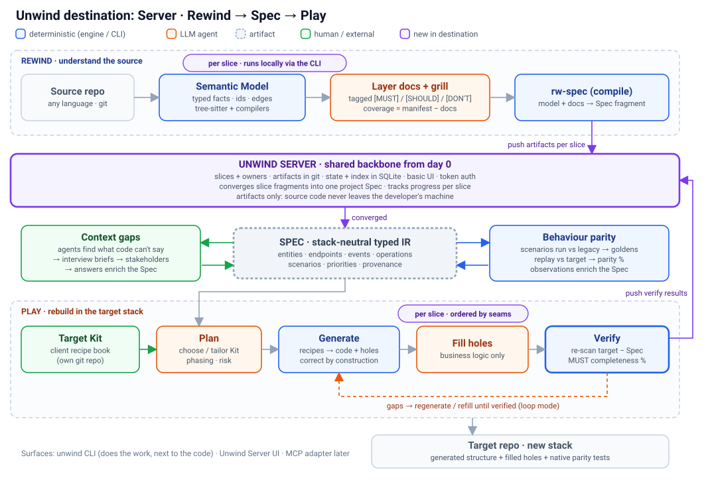
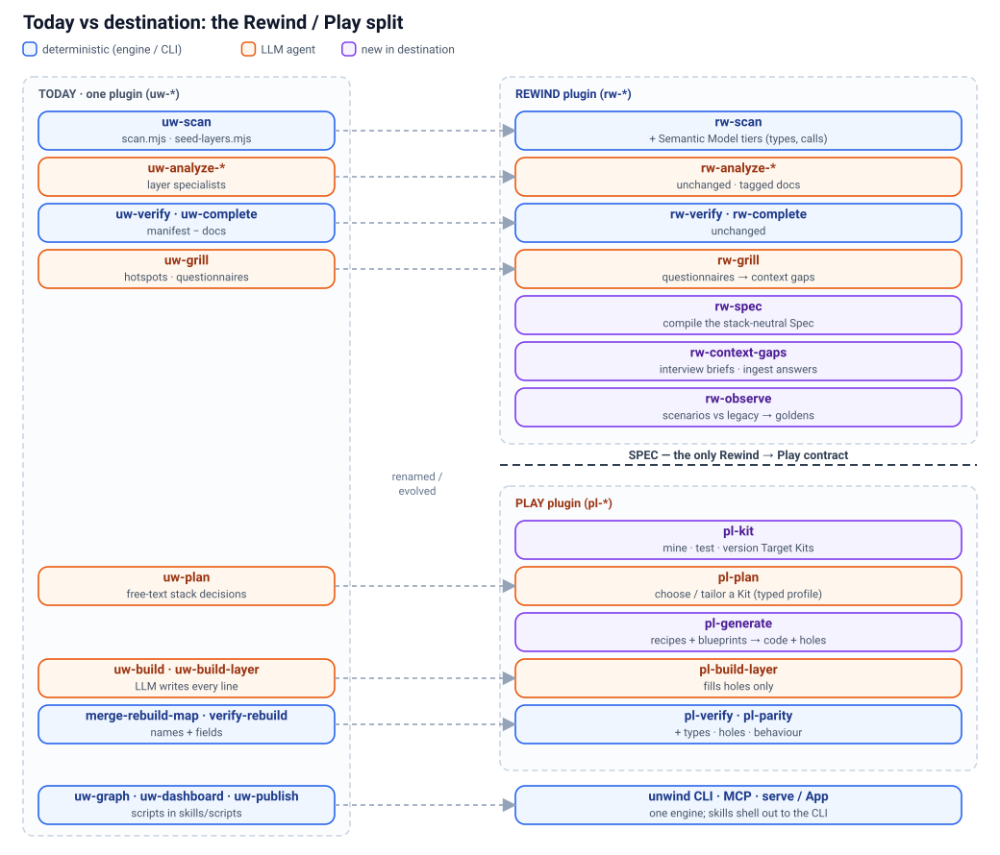
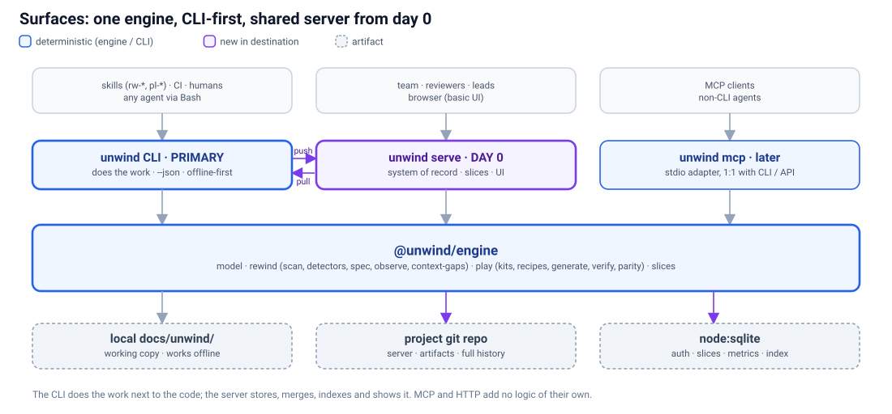

# 02 · Destination architecture

> **In short:** A self-hosted **Unwind Server** is the shared backbone from day 0: the team's system of record and UI, git- and SQLite-backed, receiving artifacts only, with **slices** as the first-class unit of work ([03](03-server-and-slices.md)). Around it sit one shared model package, two plugins and one contract between them. **Rewind** understands a legacy system, slice by slice, and compiles it into a stack-neutral **Spec**. **Play** rebuilds the Spec from a client's **Target Kit**. A single engine sits behind a **CLI-first** surface that does the work next to the code and pushes results to the server. MCP is a thin adapter. Deterministic code owns the facts and the structure; the LLM owns semantics and holes; completeness is always computed.



## 2.1 The shape

**The flow.** Developers and agents run the `unwind` CLI locally, next to the code → they **push artifacts per slice** to the **Unwind Server** (the shared record and UI) → the server **converges** slice fragments into one project **Spec** → **Play** rebuilds per slice from the Spec plus a Target Kit → **verification results are pushed back**, so progress, completeness and parity are visible per slice. Code never leaves the developer's machine; everything works offline and syncs when logged in.

**Components, in flow order:**
1. **Unwind Server** ([03](03-server-and-slices.md)): projects, slices and owners, artifacts in git, state and index in SQLite, basic UI, token auth. Present from day 0.
2. **`@unwind/model`** (§2.3): the shared ids and schemas every other part speaks.
3. **Rewind** (§2.4): understands the source, per slice, and produces Spec fragments.
4. **The Spec** (§2.5): converged on the server into one project Spec; the only Rewind → Play contract.
5. **Play** (§2.6) with **Target Kits** (§2.7): rebuilds per slice and verifies.
6. **Surfaces** (§2.8): CLI first, server UI, MCP later.

```
   ┌──────────────── UNWIND SERVER (shared backbone, day 0) ────────────────┐
   │ projects · slices + owners · artifacts (git) · state/index (SQLite) ·   │
   │ convergence → project Spec · metrics · UI · token auth                  │
   └───────▲───────────────────────▲─────────────────────────▲───────────────┘
      push │ per slice        push │ fragments          push │ verify results
```

```
            ┌──────────── @unwind/model (shared contract) ────────────┐
            │ ids · Semantic Model · Spec (IR) · Kit schema ·          │
            │ verification + state schemas · versioning                │
            └──────────────────────────────────────────────────────────┘
 SOURCE REPO ─► REWIND ─► Semantic Model ─► tagged docs ─► SPEC ──────┐
              (understand)   (facts)        (LLM + grill)  (neutral)  │
                                                                      ▼
 CLIENT KIT REPO ─► TARGET KIT (profile · conventions · recipes ·    PLAY ─► TARGET REPO
 (mined from ref app)  blueprints · golden fixtures)                 (rebuild)   │
                                                                      ▲          │
                                 VERIFY (target re-scanned by Rewind ◄───────────┘
                                         → diffed against the Spec)
 SPEC ─► CONTEXT GAPS ─► interview briefs ─► (external interview tool) ─► answers ─► enrich SPEC
 SPEC ─► PARITY SCENARIOS ─► run vs LEGACY (observe → goldens → enrich SPEC)
                        └──► run vs TARGET (same scenarios → behavioural parity)
```

## 2.2 Today compared with the destination



| Today (`uw-*`) | Destination | Change |
|---|---|---|
| `uw-scan` → `scan-manifest.json` | `rw-scan` → **Semantic Model** (typed, bound) | Additive manifest fields; extra tiers ([05](05-semantic-model.md)) |
| `uw-analyze-*`, `uw-verify`, `uw-complete` | Same, under `rw-*` | Rename plus aliases |
| `uw-grill` → `questions/` | `rw-grill`, folded into **context gaps** | One questionnaire mechanism ([07](07-context-gaps.md)) |
| (none) | `rw-spec` → **Spec** | New: the Rewind→Play contract |
| (none) | `rw-observe` / `pl-parity` | New: behaviour parity ([06](06-behaviour-parity.md)) |
| `uw-plan`, free-text stack decisions | `pl-plan`: **choose or tailor a Kit** | Typed profile replaces free text |
| `uw-build-layer` writes every line | `pl-build`: **generate from Kit**, LLM fills holes | Deterministic first ([04](04-target-kits-and-recipes.md)) |
| `verify-rebuild`: names, method+path, field-name Jaccard | Plus field **types**, holes, behavioural parity | Stronger verdicts |
| `skills/scripts/*.mjs` | `unwind` CLI (scripts become shims) | Consolidation (§2.8) |
| Single user, local `docs/unwind/` | **Unwind Server**: shared, git + SQLite, slices, UI | New from day 0 ([03](03-server-and-slices.md)) |

## 2.3 `@unwind/model`: the shared contract

The only package both plugins import. It holds:

- **The id scheme.** Today this is `manifest/candidates.ts` and `symbolId` in `manifest/manifest-schema.ts` (`kind:path:name`). The destination version adds class-qualified, overload-safe ids (e.g. `method:src/a.ts:Orders.create(2)`), because methods and overloads collide today. Ids remain the **join key** across the model, Spec, coverage, graph, kit output and verification.
- **Schemas:** Semantic Model (additive extension of `ScanManifest`), Spec, Kit manifest, rebuild state and verification (today's `graph/rebuild-state-schema.ts` and `graph/rebuild-verification.ts` types), the gap register and Scenario.
- **Versioning.** Every artifact carries `schemaVersion`. Changes are **additive-only**, as with the manifest today; breaking changes need a migration and a major bump.

## 2.4 Rewind (understand)

Today's pipeline (scan → seed → analyze → verify-coverage → complete → grill), extended with:

1. **Semantic Model**: a typed, bound fact model in tiers T0/T1/T2 ([05](05-semantic-model.md)).
2. **Detector recipes**: `layers/contract-detectors.ts` split into a fixture-tested registry.
3. **`rw-spec`**: compiles manifest, graph and tagged docs into the **Spec**.
4. **`rw-observe`**: runs Spec scenarios against the legacy app and enriches the Spec ([06](06-behaviour-parity.md)).
5. **`rw-context-gaps`**: finds what the code can't answer and produces interview briefs ([07](07-context-gaps.md)).

Every step runs locally through the CLI, scoped to a **slice** when one is claimed (`--slice`), and `unwind push` sends the resulting artifacts to the server, which converges the fragments into the project Spec ([03 §3.8](03-server-and-slices.md)).

**Front door (`rw-start`).** Before scanning, Rewind runs a **preflight** and captures **intent once**:
- an `INTENT` record (the goal, and what must stay true, e.g. "quirks included") that every later step reads. It sets parity strictness and plan defaults;
- the "only a human knows" questions (scope, can it build and test here, bespoke build infrastructure, prior attempts, off-limits areas);
- a throwaway target-stack build that proves the toolchain;
- a scope-boundary check that lists inbound consumers from the import graph.

`unwind status` derives staleness from the artifact chain and always prints **the exact next command**. *Borrowed from code-modernization ([01b §1b.8](01b-compare-code-modernization.md) #8, #9, #15).*

**Untrusted-content discipline.** Code and docs are data, never instructions:
- untrusted text is fenced in prompts;
- labels and paths are sanitized;
- analysis agents are read-only and return data, and only the orchestrator writes;
- instruction-shaped text is reported by `file:line`;
- secrets are masked to short previews before any artifact is written. This matters because `uw-publish` pushes docs to public gh-pages and the server ingests artifacts.

*Borrowed from code-modernization ([01b §1b.8](01b-compare-code-modernization.md) #12, #13).*

Rewind is **useful on its own** for documentation, onboarding, audits and due diligence, without ever running Play.

## 2.5 The Spec: the only Rewind → Play contract

A stack-neutral, typed IR of everything the target must preserve. Where a standard exists, the Spec **embeds** it rather than inventing a format: JSON Schema for shapes, OpenAPI-style operations for endpoints.

| Node kind | Carries |
|---|---|
| `entity` | Typed fields (neutral types), keys, FKs/relations, enums, physical name |
| `endpoint` | Full composed path, method, params, request/response schema refs, auth, status codes, handler ref |
| `event` / `job` | Payload schema, producer/consumer, schedule |
| `config` | Env/config keys, defaults, secrets flag |
| `integration` | External system, protocol, calls made |
| `operation` | A named business rule: description, doc ref, behavioural assertions, linked scenarios |
| `scenario` | Given/when/then at a boundary ([06](06-behaviour-parity.md)) |

Every node carries `id`, `priority` (`MUST`/`SHOULD`/`DONT` plus rationale), `docRef`, `sourceRef` and **provenance**: `scanned`, `inferred`, `observed`, `interview:<role>:<date>` or `expert`.

```json
{
  "schemaVersion": "1.0",
  "entities": [{
    "id": "table:src/db/schema.ts:orders",
    "name": "orders", "priority": "MUST",
    "fields": [
      { "name": "id", "type": "uuid", "pk": true },
      { "name": "customerId", "type": "ref(customers)", "nullable": false },
      { "name": "status", "type": "enum(pending,paid,shipped,cancelled)" },
      { "name": "totalCents", "type": "int" },
      { "name": "createdAt", "type": "datetime", "default": "now" }
    ],
    "docRef": "layers/database/tables.md#orders",
    "provenance": ["scanned", "inferred"]
  }],
  "endpoints": [{
    "id": "endpoint:src/routes/orders.ts:POST /api/orders",
    "method": "POST", "path": "/api/orders", "priority": "MUST",
    "request": { "$ref": "#/schemas/CreateOrder" },
    "responses": { "201": { "$ref": "#/schemas/Order" }, "422": { "$ref": "#/schemas/ValidationError" } },
    "auth": "session", "handlerRef": "function:src/services/orders.ts:createOrder",
    "provenance": ["scanned", "observed"]
  }],
  "operations": [{
    "id": "operation:src/services/orders.ts:applyDiscount",
    "priority": "MUST",
    "rule": "Orders over 10000 cents get 5% off; never stack with coupon discounts.",
    "rationale": "Contractual with wholesale customers (interview:stakeholder:2026-11-02)",
    "docRef": "layers/service/orders.md#applydiscount",
    "scenarios": ["scenario:orders:discount-threshold"],
    "provenance": ["inferred", "interview:stakeholder:2026-11-02"]
  }]
}
```

**Operations take the rule-card shape** (borrowed from code-modernization, see [01b §1b.8](01b-compare-code-modernization.md) #6, #7). Each `operation` carries:
- Given/When/Then with **concrete values** (e.g. "12000 cents → 11400, rounded half-up");
- `parameters`, so magic numbers become config candidates;
- `suspectedDefect`, which feeds the grill;
- `confidence` with an SME question when below high, which opens a context gap.

Every `[MUST]` operation is checked by a **citation referee** against its anchor, then by a **two-judge panel** (a compliance lens and a fidelity lens). A split verdict demotes it to `[SHOULD]` and raises a context gap ([07](07-context-gaps.md)), never a silent drop. Rule cards also seed parity scenarios ([06 §6.2](06-behaviour-parity.md)).

```json
{ "id": "operation:src/services/orders.ts:applyDiscount", "priority": "MUST",
  "given": "wholesale customer, 3 × 4000-cent items, no coupon",
  "when": "the order is created",
  "then": "totalCents = 11400 (12000 − 5%, rounded half-up)",
  "parameters": [{ "name": "discountThresholdCents", "value": 10000 }, { "name": "discountRate", "value": 0.05 }],
  "suspectedDefect": null, "confidence": "high",
  "review": { "referee": "confirmed", "panel": ["compliance:keep", "fidelity:keep"] } }
```

A Spec can also be **hand-written**, which makes Play usable for greenfield work.

## 2.6 Play (rebuild)

1. **`pl-plan`.** The interview narrows to *choosing or tailoring a Kit*: phasing, re-use and risk. It writes a typed profile in place of today's free-text `rebuild-decisions.json` (which stays as a record).
2. **Resolve the Kit.** Pin `kit@version` in `rebuild-state.json`.
3. **Generate.** Recipes and blueprints run over the Spec and write target files, map entries (the existing `rebuild-map/*.json` format) and **holes** ([04](04-target-kits-and-recipes.md)). The scaffold recipe finally sets the dormant `config.scaffolded` flag in `rebuild-state-schema.ts`.
4. **Fill.** `pl-build-layer` subagents fill *only* holes plus any unmapped `[MUST]` items.
5. **Verify.** Structural and typed diff (an extended `graph/rebuild-verification.ts`), hole accounting, and behavioural parity (`pl-parity`).
6. **Loop.** The existing loop-until-verified mechanics, with completeness % and parity % as termination signals.
7. **Push.** Rebuild maps and verification results are pushed per slice; the server tracks each slice through its Play states (planned → generating → filling → verified → cut-over) and orders slices by their seams ([03 §3.7–3.8](03-server-and-slices.md)).

**Fallback.** If there is no Kit match, or no Node/core, today's pure-LLM `uw-build` flow runs unchanged, and the skill says so.

## 2.7 Target Kits

Per-client, versioned git repos that encode the client's **golden path**: stack profile, conventions, type map, recipes, blueprints and golden fixtures. They are mined primarily from the client's reference app. Starter kits (first: `hono-drizzle-zod`) ship with Play. See [04](04-target-kits-and-recipes.md).

## 2.8 Surfaces: one engine, CLI first, a shared server from day 0



```
@unwind/engine (library: model, rewind, play, kits, parity, gaps, slices)
     ├── unwind CLI      ← PRIMARY execution surface. Skills shell out to it. CI / humans / any agent.
     │                     works fully offline; when logged in, pushes artifacts to the server
     ├── unwind serve    ← DAY 0: shared system of record + basic UI (Hono API, git + SQLite, slices)
     └── unwind mcp      ← later: thin stdio MCP adapter; tools map 1:1 to CLI commands / API routes
```

**Division of labour:**
- The **CLI does the work** (scan, analyze, generate, verify) next to the code.
- The **server stores, merges, indexes and shows** it: projects, **slices**, history, convergence and metrics.
- Source code never goes to the server; only artifacts do. See [03](03-server-and-slices.md) for storage, auth (simple bearer tokens via `unwind login`), push/pull, slices, convergence, UI and the API.

**Why the CLI rather than MCP for the skills:**
- The skills already shell out to `node skills/scripts/*.mjs` via `_resolve-plugin-root.sh`/`ensure_unwind_core`. That is a CLI in all but name, so this is a consolidation.
- A CLI works in CI, for humans and from any agent, with no daemon or connection state. MCP availability varies by client and would weaken the graceful fallback.
- `--json` output and exit codes make it testable. Long-running steps (generate, parity) fit processes better than tool calls.

**Command map:**

```
unwind rewind  scan | seed | coverage | grill-brief | spec | observe | context-gaps | context-ingest
unwind play    plan-brief | kit mine | kit test | generate | merge | verify | parity
unwind slices  propose | list | claim | release | status
unwind         login | logout | whoami | project link|create | push | pull | status
unwind         graph | publish | serve | mcp
common flags   --project <src> --target <dir> --kit <repo@ver> --slice <id> --json --plan (dry run)
```

**Distribution** is an npm package (`npx @unwind/cli`) plus the server Docker image. `ensure_unwind_core` becomes `ensure_unwind_cli`. The current `.mjs` scripts become one-line shims for one release.

**Server tech stack** (detail in [03 §3.3](03-server-and-slices.md)):
- **Hono** on Node (`@hono/node-server`), with zod validation (`@hono/zod-validator`) and `hono/client` RPC types shared with the CLI and UI;
- **React + Vite** UI with **TanStack Query** (TanStack Router recommended) and **Tailwind + daisyUI**, dark by default and mapped onto the dashboard tokens, reusing the React Flow/ELK graph and `DocsViewer` from `packages/dashboard`;
- **`node:sqlite`** (Drizzle recommended for schema and migrations) plus **system git**;
- one Docker image serving API and UI from the same Hono app.
- This is the stack of the pilot starter kit, so **Unwind dogfoods its own target kit**.

**The MCP adapter and the HTTP API add no logic of their own**, so behaviour is identical across surfaces.

## 2.9 Packaging and naming

- One repo and two plugins: **Rewind** (`rw-*` skills) and **Play** (`pl-*` skills). **Unwind** stays the umbrella brand.
- Packages: `@unwind/model`, `@unwind/engine` (initially today's `@unwind/core`, renamed and grown), `@unwind/cli`, `@unwind/server` (Hono API + storage) and `@unwind/app` (today's `@unwind/dashboard`, grown into the server UI).
- The `uw-*` skills stay as deprecated aliases for one release.

## 2.10 Invariants

- **Hybrid rule.** Deterministic code owns every verifiable fact and every structural artifact. The LLM owns semantics and holes. Completeness is computed by set arithmetic over ids.
- **Additive schemas only.** No reshaping `FileSymbols`; add optional fields.
- **AST and real parsers over regex**, on both sides: detectors read ASTs, and recipes edit target files with ts-morph or tree-sitter.
- **Graceful fallback at every step**, announced to the user.
- **Files are the source of truth.** Locally, that is `docs/unwind/`. On the server, it is the project's git repo. SQLite holds auth and operational state plus a **rebuildable** index.
- **Code stays local.** Only artifacts are pushed to the server ([03 §3.11](03-server-and-slices.md)).
- **Slices are first-class.** Candidate ids define slice membership, and convergence is set arithmetic over them ([03 §3.7–3.8](03-server-and-slices.md)).
