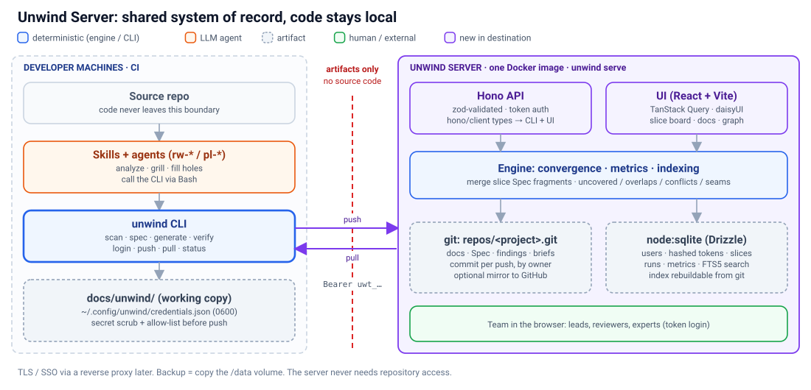
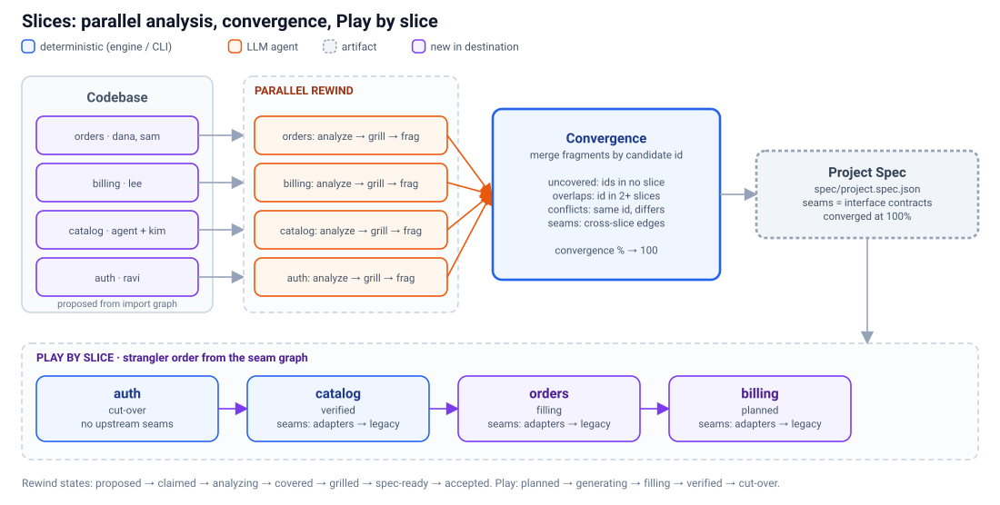

# 03 · Unwind Server and slices

> **In short:** From day 0, a self-hosted **Unwind Server** (one Node process in one Docker image) is the team's shared system of record. It provides a small web UI. The CLI keeps doing the work locally and **pushes artifacts only**: source code never leaves developers' machines. Storage is **git** (reviewable artifacts, full history) plus **SQLite** (auth, slices, metrics, query index). **Slices** are first-class units of work that run through *both* halves. Teams analyze them in parallel, the server **converges** their Spec fragments into one project Spec, and the same slices later become Play's strangler-style rebuild units.



## 3.1 Why a server from day 0

On a large codebase, one person running Unwind in one session does not scale.
- Analysis is spread across people and agents over weeks.
- Reviewers who are not developers need to read the docs and answer questions.
- Leads need to see progress, and the Spec has to be one shared thing, not N local copies.

Files in each developer's `docs/unwind/` are fine for one person. For a team they need a home with **history, ownership, progress and a UI**. The server provides that home without changing how the work is done: the **CLI stays the execution surface** (doc 02 §2.8), and the server stores, merges, indexes and shows.

## 3.2 Shape: `unwind serve`

- A **single Node process** (`unwind serve`), shipped as one Docker image (`ghcr.io/nearform/unwind-server`).
- One Hono app serves the **HTTP JSON API** and the **built UI** as static assets.
- Everything lives under one data volume:

```
/data
  unwind.db                 node:sqlite: auth, projects, slices, runs, metrics, index (WAL mode)
  repos/<project>.git       bare git repo per project: the reviewable artifacts
  tmp/                      push staging
```

```bash
docker run -d --name unwind -p 8080:8080 \
  -v unwind-data:/data \
  -e UNWIND_ADMIN_TOKEN="$(openssl rand -hex 32)" \
  ghcr.io/nearform/unwind-server:latest
```

- **Backup** is a copy of `/data`. Run the SQLite online backup, or stop the container first.
- **TLS and SSO** come from a reverse proxy in front (Caddy, nginx, Cloudflare Tunnel). They are out of scope for day 0 (§3.12).
- Running without Docker works too: `npx @unwind/cli serve --data ./unwind-data`.

## 3.3 Tech stack

The server is built on **the same stack as the pilot starter kit** (`hono-drizzle-zod`, doc 04). Unwind therefore **dogfoods its own target kit**: the server is a living reference app that the kit can be mined from and tested against.

| Concern | Choice | Notes |
|---|---|---|
| HTTP API | **Hono** on Node (`@hono/node-server`) | Typed routes. The one app also serves the UI's static assets. |
| Validation | **zod** via `@hono/zod-validator` | The schemas live in `@unwind/model`, shared with the CLI. |
| Typed client | **`hono/client`** RPC types | The CLI and UI call the API through the same inferred types, with no hand-written client. |
| UI | **React + Vite** | It grows out of `packages/dashboard`. |
| Server state in UI | **TanStack Query** | Caching, refetch and optimistic slice claims. |
| Routing in UI | **TanStack Router** (recommended) | Type-safe routes and search params. It replaces today's hand-rolled `urlState.ts` over time. |
| Components and theming | **Tailwind + daisyUI** | Dark default. daisyUI themes are mapped onto the existing dashboard tokens (`--color-* → --c-*`). |
| Reused UI | React Flow + ELK graph, `DocsViewer`/`MarkdownView` | Taken as they are from `packages/dashboard`. |
| Database | **`node:sqlite`** (built into Node ≥22.5) | WAL mode. FTS5 for search. |
| ORM / migrations | **Drizzle** over node:sqlite (recommended) | Typed schema plus generated migrations. Matches the starter kit. |
| Git | **System `git`, called from the server process** (recommended), installed in the image | Fully compatible with real git (packs, `receive`, mirror push). isomorphic-git is a fallback for git-less environments. |
| Packaging | One Docker image (`node:22-slim` + git) | `unwind serve` is the entrypoint. |

## 3.4 Storage: git for artifacts, SQLite for state and index

**Git is the source of truth for reviewable artifacts.** Each project has one bare repo, with the same layout as a local `docs/unwind/` plus slice folders:

```
architecture.md
layers/**                        tagged layer docs (shared)
slices/<slice-id>/
  slice.json                     scope, owners, state
  docs/**                        slice-specific layer docs
  spec.fragment.json             this slice's Spec fragment
  findings.json · gaps.json      grill findings, context gaps
spec/project.spec.json           converged Spec (written by the server, §3.8)
questions/** · interviews/**     questionnaires, briefs, responses
rebuild/**                       rebuild-map, state, verification (Play)
.cache/scan-manifest.json        manifest (ids are the join key)
```

- **Every push is a commit** authored by the token's owner: `Author: Dana Lee <dana@client.com>`, with a trailer `Unwind-Slice: orders`.
- That gives history, diff, blame and revert for free. It also allows an optional **mirror push** to a GitHub/GitLab repo for clients who want the artifacts next to their code.

**SQLite holds operational state plus a query index:**

| Table group | Contents | Rebuildable from git? |
|---|---|---|
| `users`, `tokens` | Identity and hashed tokens (§3.5) | No (back them up) |
| `projects`, `slices`, `claims` | Ownership, state, claims | Partly: slice state is mirrored to `slice.json` |
| `runs` | Who ran which CLI command, when and against which commit, with result metrics | No (audit) |
| `metrics` | Time series: doc coverage, context coverage, parity %, completeness %, convergence % per slice and per project | Yes, recomputable per commit |
| `spec_nodes`, `gaps`, `findings` | Parsed Spec, gap register and grill findings, for queries and the UI | Yes |
| `search` (FTS5) | Full-text search over docs and the Spec | Yes |

`unwind serve --reindex` rebuilds every "Yes" table by walking git history, so the index can always be thrown away and rebuilt.

## 3.5 Auth: simple bearer tokens

The model is deliberately minimal.

- **Bootstrap.** `UNWIND_ADMIN_TOKEN` (env) is an admin token on first start. The admin creates users, for example in the UI, by name and email.
- **Personal tokens.** Users create tokens in the UI (`Settings → Tokens`). Each has a name, scopes and an optional expiry. A token is shown once as `uwt_<32 random bytes base62>` and stored **sha256-hashed**.
- **Scopes:** `read` (view and pull), `write` (push, claim slices, answer questions) and `admin` (users, projects, tokens). Project membership is a simple allow-list per project.
- **Requests** use `Authorization: Bearer uwt_…`. The UI uses the same token, kept in an HttpOnly cookie after a token-paste login.

CLI:

```bash
unwind login https://unwind.internal.client.com   # prompts for a token, verifies via /api/me
# → ~/.config/unwind/credentials.json (mode 0600): { "servers": { "<url>": { "token": "uwt_…", "user": "dana" } }, "default": "<url>" }
unwind whoami                                      # user, server, scopes, projects
unwind logout [--server <url>]
```

`UNWIND_TOKEN` / `UNWIND_SERVER` env vars override the file, for CI.

## 3.6 CLI sync: local working copy, push and pull

- The local `docs/unwind/` stays **the working copy**. Every command still works with no server, in line with the graceful-fallback principle. The server is additive.
- The project is linked to a server project in `docs/unwind/.unwind.json`: `{ "server": "<url>", "project": "acme-billing" }`.

```bash
unwind project link acme-billing            # or: unwind project create acme-billing
unwind status                               # local vs server: ahead/behind, changed files, slice claims
unwind push [--slice orders] [-m "message"] # changed files → one commit on the server
unwind pull [--slice orders]                # fast-forward the working copy
```

**How push works:**
1. The CLI sends a bundle of changed files (paths, content and hashes) plus the **base revision** it last pulled.
2. The server writes a commit if `base == HEAD`, or if none of the touched paths changed since `base` (a non-conflicting path-level merge).
3. Otherwise it returns **409** with the conflicting paths. The CLI pulls, replays and retries.
4. Because each slice owns its own folder (§3.4), concurrent pushes from different slices almost never conflict.

**Before a push,** the CLI:
- **scrubs secrets** (token, key and connection-string detectors; the push is refused if anything is found, with `--allow` to override per file);
- enforces the **artifact allow-list** (§3.11).

**Skills** call the CLI as they do today. When logged in and linked, long-running skills (`rw-analyze`, `rw-grill`, `pl-build`) push at checkpoints, so progress shows up live in the UI.

## 3.7 Slices: the first-class unit of work



A **slice** is a bounded area of the codebase that one owner or team carries from analysis through rebuild:

```json
{
  "id": "orders",
  "name": "Orders & checkout",
  "scope": {
    "paths": ["src/orders/**", "src/checkout/**", "db/migrations/*orders*"],
    "layers": ["service", "api", "database"],
    "capabilities": ["ordering", "payments"]
  },
  "owners": ["dana", "sam"],
  "rewind": { "state": "covered" },
  "play": { "state": "planned" },
  "metrics": { "coverage": 0.94, "contextCoverage": 0.61, "parity": null, "completeness": null }
}
```

**Proposal.** After the first local full scan, `unwind slices propose` (or the UI) suggests slices deterministically:
- clustering the **import graph** (today's `importMap`, later call edges);
- seeded by top-level directories and layers;
- balanced by candidate count.

Humans then rename, merge, split and assign. The scope globs resolve to a **set of candidate ids**, and that set *is* the slice's membership.

**States** run through both halves:

| Half | States |
|---|---|
| Rewind | `proposed → claimed → analyzing → covered → grilled → spec-ready → accepted` |
| Play | `planned → generating → filling → verified → cut-over` |

- Transitions are mostly **computed**. For example, `covered` means slice coverage is 100% per `verify-coverage` over the slice's ids, and `verified` means `[MUST]` completeness is at its target.
- `claimed`, `accepted` and `cut-over` are explicit human actions.

**Per-slice artifacts:** docs, coverage and gaps, Spec fragment, grill findings, context gaps, interview briefs and, later, rebuild map, verification and parity.

## 3.8 Convergence: fragments into one project Spec

The server merges the slices' `spec.fragment.json` files into `spec/project.spec.json`, using **candidate ids as the join key**. This is the same set arithmetic Unwind already uses for coverage. On every push it reports:

| Signal | Definition | Resolution |
|---|---|---|
| **Uncovered** | Manifest ids in no slice scope | Widen a scope, or create a slice |
| **Overlaps** | An id in two or more slice scopes | Assign one owner; the other slice references it |
| **Conflicts** | The same id with a different priority or content across fragments | Owners resolve in the UI; the decision is recorded with rationale |
| **Seams** | Imports, calls or reads/writes crossing slice boundaries | Become **interface contracts** in the Spec that both slices must honour |

- **Convergence %** = ids that are in exactly one slice, conflict-free and spec-ready, divided by all manifest ids (excluding `[DON'T]`). The project Spec is **converged** at 100%.
- **Seams drive Play.** They form a slice dependency graph, which gives the **strangler-style rebuild order**. A slice can be rebuilt and cut over once its upstream seams are satisfied, either by already-rebuilt slices or by an adapter onto the legacy app. Seams are also first-class scenarios for parity (doc 06).

## 3.9 UI (basic, day 0)

The UI is built by evolving `packages/dashboard` into the app served by `unwind serve`, reusing its graph and docs components.

| View | Shows |
|---|---|
| **Projects** | List, with last push and headline metrics |
| **Project overview** | Coverage, context, convergence, parity and completeness over time (from `metrics`); recent activity |
| **Slice board** | Kanban by state (Rewind and Play lanes), owners and a **Claim** button; filter by owner or capability |
| **Slice detail** | Rendered docs (existing `DocsViewer`), gaps, Spec fragment, findings, open questions and its metrics |
| **Graph** | Existing React Flow + ELK view, **coloured by slice**, with seams highlighted |
| **Convergence** | Uncovered, overlaps and conflicts (with resolve actions), and seams |
| **Questions & interviews** | Grill questionnaires and interview briefs; answer in place (writes back via a commit) |
| **Activity** | Git log per project and slice, with diffs |
| **Settings** | Tokens, users and project members (admin) |

## 3.10 API sketch

All routes are JSON and bearer-authenticated, typed through `hono/client`. The future MCP adapter maps onto these routes.

| Method and route | Purpose | Scope |
|---|---|---|
| `GET /api/me` | Current user, scopes, projects | read |
| `GET/POST/DELETE /api/tokens` | Personal token management | read / write |
| `GET/POST /api/projects` | List or create projects | read / admin |
| `GET /api/projects/:p` | Overview and headline metrics | read |
| `GET/POST /api/projects/:p/slices` | List slices, or create/propose them | read / write |
| `PATCH /api/projects/:p/slices/:s` | Rename, rescope or change state | write |
| `POST /api/projects/:p/slices/:s/claim` | Claim or release a slice | write |
| `POST /api/projects/:p/push` | File bundle plus base revision → commit (409 on conflict) | write |
| `GET /api/projects/:p/pull?since=<rev>` | Changed files since a revision | read |
| `GET /api/projects/:p/artifacts/*path` | Read any artifact (optionally `?rev=`) | read |
| `GET /api/projects/:p/spec` | The converged project Spec | read |
| `GET /api/projects/:p/graph` | `rebuild-graph.json` plus slice colouring | read |
| `GET /api/projects/:p/convergence` | Uncovered, overlaps, conflicts, seams, % | read |
| `GET/POST /api/projects/:p/runs` | Record or list CLI runs and metrics | read / write |
| `GET /api/projects/:p/search?q=` | FTS5 over docs and Spec | read |

## 3.11 Security and data policy

- **Code stays local.** The server never needs repository access or credentials. The CLI scans and analyzes locally and pushes **artifacts only**:
  - manifests (paths, symbol names, line numbers);
  - docs;
  - Spec;
  - findings and questions;
  - rebuild maps and verification.
- Code appears on the server **only** where docs already quote it, such as grill evidence quotes. Clients can disable quotes per project (`policy.quotes: false`), in which case the CLI strips fenced code from docs on push.
- **Treat pushed artifacts as untrusted.**
  - The server renders docs with no raw HTML.
  - It never executes or interprets instruction-shaped text in artifacts.
  - It surfaces any `injectionFlags` the CLI recorded.
  - Secrets found by the pre-push scrubber are masked to short previews and kept in a local, gitignored `SECRETS.local.md`.

  *Borrowed from code-modernization ([01b §1b.8](01b-compare-code-modernization.md) #12, #13).*
- **Allow-list on push.** Only known artifact paths are accepted, on both the server and the CLI.
- **Secret scrubbing** before push (§3.6).
- **Audit:** every write is a git commit plus a `runs` row, tied to a named user.
- **Self-hosted by default.** The server runs inside the client's network next to the code, so artifacts never leave it unless the client mirrors them.

## 3.12 Scale and scope

**Large codebases:**
- Run **one full scan locally**, push the manifest, and propose slices.
- People and agents then analyze slices **in parallel**: each `rw-analyze --slice orders` run sees only that slice's seeds.
- The server's convergence keeps the whole picture honest.
- Incremental refresh (`detect-changes`) re-opens only the slices whose ids changed.

**Out of scope for day 0** (possible later options):
- SSO/OIDC (put a reverse proxy in front for now);
- multi-tenant SaaS;
- server-side repo cloning and scheduled re-scans;
- a Cloudflare-native variant;
- fine-grained RBAC beyond read/write/admin plus project allow-lists;
- real-time collaborative editing (a git commit per push is enough).
