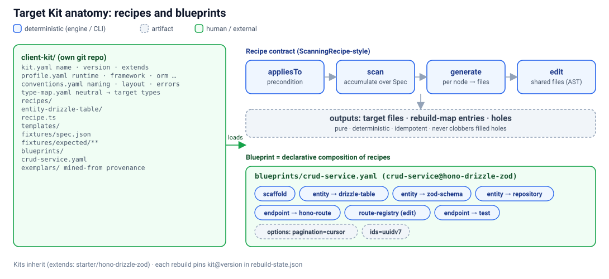
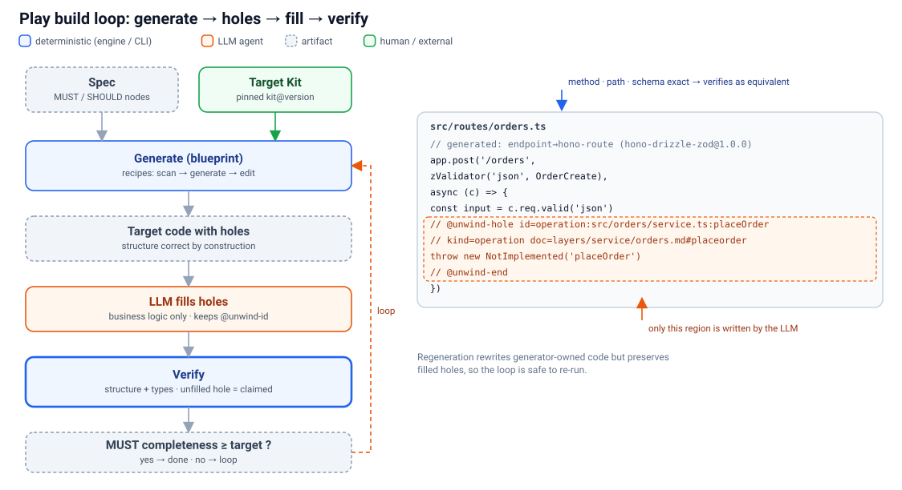
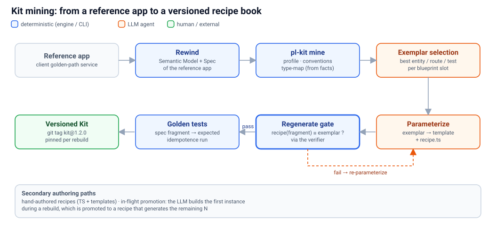

# 03 · Target Kits, recipes, blueprints and holes

> **In short:** A **Target Kit** is a client's golden path packaged as a versioned git repo: a typed stack profile, conventions, a type map, **recipes** (pure Spec→code generators) and **blueprints** (recipes composed into whole services). Play runs the Kit over the Spec to generate code that is correct by construction. Anything it can't derive becomes an explicit **hole** for the LLM. Kits are mined mainly from the client's own reference app.



## 3.1 Why kits

Today `uw-build-layer` writes every line with an LLM. The trouble with that:
- Forty tables come out forty slightly different ways.
- Conventions drift between slices.
- Every re-run is a fresh roll of the dice.

Most of a rebuilt service is **structural**: schema, routes, validators, wiring, repositories, test skeletons. Structure is fully determined by the Spec plus the client's conventions. Kits make that part deterministic, reviewable and repeatable, and leave the LLM to do what only it can: business logic.

Kits are **per client** because "the target" is never just "Hono + Drizzle". It is *this client's* Hono + Drizzle: their error envelope, logging, id strategy, folder layout and internal SDKs.

## 3.2 Kit repo layout

```
acme-kit/
├── kit.yaml            # name, version, extends, compatible spec schemaVersion
├── profile.yaml        # typed stack profile
├── conventions.yaml    # naming, layout/module map, error model, logging, ids, pagination
├── type-map.yaml       # Spec neutral types → target types
├── recipes/
│   └── entity-drizzle-table/
│       ├── recipe.ts           # or recipe.yaml for simple declarative recipes
│       ├── templates/table.ts.tmpl
│       └── fixtures/{spec.json, expected/**}
├── blueprints/
│   ├── crud-service.yaml
│   └── full-app.yaml
└── exemplars/          # provenance: ref-app files each recipe was mined from (commit-pinned)
```

```yaml
# kit.yaml
name: acme-kit
version: 1.4.0
extends: unwind/hono-drizzle-zod@^1     # inherit the starter kit, override what differs
spec: ">=1.0 <2"
```

```yaml
# profile.yaml
runtime: cloudflare-workers
language: typescript
framework: hono
apiStyle: rest
orm: drizzle
db: d1
validation: zod
auth: acme-session-sdk
testing: vitest
infra: wrangler
```

```yaml
# conventions.yaml (excerpt)
naming: { tables: snake_plural, columns: snake, files: kebab }
layout: { routes: "src/routes/{module}.ts", schema: "src/db/schema/{entity}.ts" }
errors: { envelope: "{ error: { code, message, details } }", validationStatus: 422 }
ids: uuidv7
pagination: cursor
```

```yaml
# type-map.yaml (excerpt)
string:   { drizzle: "text", zod: "z.string()" }
int:      { drizzle: "integer", zod: "z.number().int()" }
datetime: { drizzle: "integer({ mode: 'timestamp' })", zod: "z.coerce.date()" }
uuid:     { drizzle: "text", zod: "z.string().uuid()" }
```

## 3.3 The recipe contract

Modelled on OpenRewrite's `ScanningRecipe`: **scan → generate → edit**.

```ts
export interface TargetRecipe<Acc = unknown> {
  name: string;
  description: string;
  /** Precondition: does this recipe apply to this Spec node under this profile? */
  appliesTo(node: SpecNode, profile: StackProfile): boolean;
  /** Optional cross-node pass (e.g. collect all entities for a schema barrel). */
  scan?(spec: Spec, acc: Acc): void;
  /** Pure: Spec node + kit → files, source→target map entries, holes. */
  generate(node: SpecNode, kit: ResolvedKit, acc: Acc): {
    files: GeneratedFile[];
    mappings: MapEntry[];     // same shape as rebuild-map/*.json mappings
    holes: Hole[];
  };
  /** Optional: AST edits to shared files (router registry, DI, migrations index). */
  edit?(project: TargetProject, acc: Acc): void;
}
```

**Rules:**
- **Pure and deterministic.** The same Spec plus the same Kit version always produce byte-identical output.
- **Idempotent.** Re-running gives no diff. Generator-owned regions are rewritten, and **filled holes are never clobbered**.
- **AST edits only** for shared files (ts-morph for TS targets, tree-sitter otherwise). No regex, per repo convention.
- **Equivalent by construction.** The output must verify as `equivalent` in `graph/rebuild-verification.ts`: same method plus normalised path, and the same field names and (now) types.
- **Golden-tested.** `fixtures/spec.json` → `expected/**` is checked by `unwind play kit test`, and every recipe is run twice to assert idempotence. This is our version of `RewriteTest`.

Recipes are TS modules plus template files. Recipes for non-TS targets still emit text and are finished by a target-language formatter. Simple recipes can be declarative (`recipe.yaml`: template plus `appliesTo` selector).

## 3.4 Blueprints

A blueprint is a declarative composition of recipes, the analogue of a declarative recipe list. Each one covers a whole service, module or application skeleton.

```yaml
# blueprints/crud-service.yaml
name: crud-service
description: REST CRUD module per entity, with validation, repository and tests
recipes:
  - scaffold                       # package.json, tsconfig, app entry, wrangler, vitest (once)
  - entity-drizzle-table:   { for: entity }
  - entity-zod-schema:      { for: entity }
  - entity-repository:      { for: entity, options: { softDelete: true } }
  - endpoint-hono-route:    { for: endpoint }
  - route-registry                 # edit phase: mount routes in src/app.ts
  - endpoint-parity-test:   { for: scenario }   # native tests from Spec scenarios (§5.6)
```

During `pl-plan`, each Spec slice is assigned a blueprint: `crud-service` for the orders module, `event-consumer` for webhooks, and so on.

## 3.5 Holes: the deterministic/LLM boundary

A recipe emits a **hole** wherever the Spec does not determine the code. Typical cases are business-rule bodies, non-trivial mappings and bespoke validation.

```ts
// src/routes/orders.ts (generated by endpoint-hono-route@1.4.0; do not edit outside holes)
import { Hono } from "hono";
import { zValidator } from "@hono/zod-validator";
import { CreateOrder } from "../schemas/order";
import { ordersRepo } from "../db/repos/orders";

export const orders = new Hono();

// @unwind-id endpoint:src/routes/orders.ts:POST /api/orders
orders.post("/api/orders", zValidator("json", CreateOrder), async (c) => {
  const input = c.req.valid("json");
  // @unwind-hole id=operation:src/services/orders.ts:applyDiscount kind=operation doc=layers/service/orders.md#applydiscount
  throw new Error("unwind-hole: applyDiscount not implemented");
  // @unwind-hole-end
  const order = await ordersRepo.create(c.env.DB, input);
  return c.json(order, 201);
});
```

- **The LLM builder fills only holes.** It works from the linked doc and Spec node, and keeps the `@unwind-id` provenance marker.
- **Verification.** A Spec node whose target still contains an unfilled hole is `claimed`, not `present`, so it does not count toward completeness.
- **Regeneration is safe.** The generator rewrites everything *outside* `@unwind-hole … @unwind-hole-end`, and preserves the hole's contents once filled.

## 3.6 The Play build loop



1. `unwind play generate --slice database --plan`: a dry run that lists the files, map entries and holes.
2. `unwind play generate --slice database` writes:
   - the target files;
   - `docs/unwind/.cache/rebuild-map/<slice>.generated.json`, which `merge-rebuild-map` folds in unchanged;
   - `holes.json`.
3. `pl-build-layer` is dispatched with **holes plus the unmapped `[MUST]` nodes from `rebuild-graph.json`**. This also fixes today's mismatch, where the untagged seed file is pasted in.
4. `unwind play merge`, then `verify`, then `parity`. The loop continues until completeness % and parity % reach their targets, or until two dry rounds pass (the existing `LoopState`).

## 3.7 Kit mining (primary authoring path)



Clients rarely want "a generic Hono app". They want *their* service template. So we mine it:

1. **Rewind the reference app.** Run the normal scan, Semantic Model and Spec on the client's golden-path service.
2. **Infer the deterministic parts** with `unwind play kit mine --from <ref-repo>`:
   - `profile.yaml`, from dependency manifests and detected frameworks;
   - `conventions.yaml`, from naming and layout statistics;
   - `type-map.yaml`, from observed Spec type → target type pairs.
3. **Pick an exemplar per recipe slot** that the chosen blueprint needs (entity, route, repository, test, …). The selection is ranked by Spec completeness and conformity with conventions.
4. **Parameterise.** The LLM turns each exemplar into a template plus `recipe.ts`. The exemplar's own Spec fragment becomes the **golden fixture**.
5. **Regenerate gate.** A recipe is accepted only if it regenerates its exemplar from that Spec fragment, structurally equivalent per the verifier (and textually close after formatting). Golden tests then lock it in.
6. **Version.** Tag the kit (`v1.0.0`). Each rebuild pins `kit@version` in `rebuild-state.json`.

**Secondary paths:**
- **Hand-authored recipes**, written by platform engineers like any other TS module.
- **In-flight promotion.** During a rebuild, the LLM hand-builds the first instance of a pattern. Play offers to promote it into a recipe (through the same regenerate gate), and the recipe then generates the remaining N.

## 3.8 Starter kits

Play ships a starter kit as the reference implementation of the format. The first is `hono-drizzle-zod` (TypeScript, Workers/Node; recipes: scaffold, entity → Drizzle table, entity → Zod schema, entity → repository, endpoint → Hono route, route registry, scenario → vitest test). Client kits usually `extends` a starter and override conventions and templates. Later starters are listed in [06](06-roadmap.md) (Spring/JPA, FastAPI/SQLAlchemy).

## 3.9 What kits do not do

- **They do not translate code.** Kits generate from the Spec, never from the source code. That is the whole point of the Spec boundary.
- **They do not guess.** An unknown type or rule becomes a hole and is reported, never invented.
- **They do not replace review.** Generated slices arrive as small, mapped diffs in the target repo, and the holes are listed for reviewers.
