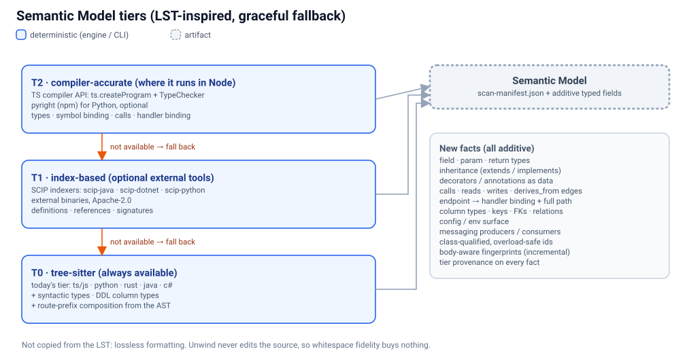

# 05 · Semantic Model and store

> **In short:** Borrow the *semantics* of the LST (types and symbol binding), not its losslessness, because Unwind never edits the source. Build the model in tiers (compiler-accurate T2, index-based T1, tree-sitter T0), each falling back gracefully to the one below. Store it as additive manifest facts plus fact tables, and add a local index later for multi-repo queries.



## 5.1 What we have today

The analysis is in `packages/core/src` (see `structure/`, `imports/`, `layers/`, `graph/`). Its limits:

| Area | Today | Gap |
|---|---|---|
| Symbols | Functions, classes, method/property **names**, param **names** (TS/JS, Python, Rust, Java, C#) | No types, no return types, no generics, no inheritance, no interfaces/type aliases/enums (TS) |
| Binding | File→file `importMap` only (relative TS/JS, Java FQN from the path, Python dotted) | No symbol→symbol binding; Rust/C#/TS path aliases unresolved |
| Calls | None | No call graph, no endpoint→handler, no function→table reads/writes. `derives_from` is declared but never emitted |
| Data model | Table/entity **field names** (Drizzle and JPA via AST, others via regex) | No column types, keys, FKs, relations or indexes; EF Core has no fields |
| Endpoints | Method + path (Express-style regex; Spring/Nest/FastAPI/ASP.NET via AST) | Class/router **prefixes not composed**; no request/response shapes, auth or status codes |
| Lifetime | The tree is deleted after per-file extraction (`structure/tree-sitter-plugin.ts`) | Nothing survives for later queries |
| Ids | `kind:path:name` | Overloads and same-named methods collide |

These are exactly the facts a rebuild needs to be typed and checkable, and exactly what the verifier lacks (`graph/rebuild-verification.ts` notes that field types are not in the manifest).

## 5.2 Tiers

| Tier | How | Languages (initially) | Gives |
|---|---|---|---|
| **T2 compiler-accurate** | The language's own type checker, in-process in Node | TS/JS via the **TypeScript compiler API** (`ts.createProgram` + `getTypeChecker()`, the same route OpenRewrite takes for JS/TS); Python via **pyright** (an npm package) later | Resolved types, symbol binding, references, calls, inheritance |
| **T1 index-based** | Optional external **SCIP** indexers (Apache-2.0: scip-typescript, scip-python, scip-java, scip-dotnet) | Java, C#, Python, others | Definitions, references, signatures |
| **T0 syntactic** | Today's tree-sitter extractors, extended | All six grammars | Syntactic types (annotations, DDL column types), decorators as data, composed route prefixes |

**Rules:**
- **Fall back, and report.** T2 runs only when the prerequisites exist (e.g. a `tsconfig.json` and a resolvable `typescript`). Otherwise the extractor drops to T1 or T0 and **records the tier reached per file**: `semanticTier: 0|1|2`. Unlike OpenRewrite's silent `Unknown`, a tier shortfall is visible in coverage reports and in the dashboard.
- **No hand-rolled regex** for new facts. Tree-sitter, compiler APIs or real parsers only. SQL uses a real SQL parser, and ORM schemas use the ORM's own snapshot or schema (Drizzle `meta/*_snapshot.json`, `schema.prisma`).
- **Facts, not trees.** We extract and persist facts. We never hold or serialise whole trees, which avoids the LST memory ceiling.

## 5.3 New facts (all additive)

Additions to `manifest/manifest-schema.ts` are optional fields only. `FileSymbols` is never reshaped.

| Fact | Where it lands |
|---|---|
| Field / param / return types | `SymbolDefinition.fieldTypes?`, `SymbolFunction.paramTypes?`, `returnType?` |
| Inheritance, interfaces, type aliases, enums | `SymbolClass.extends?`, `implements?`; new optional `types?[]` on `FileSymbols` |
| Decorators / annotations as data | `decorators?: {name, args}[]` on symbols |
| Symbol references | `symbolRefs?: {from, to, kind: call|read|write|import}[]` |
| Endpoint handler + full path | `SymbolEndpoint.handler?`, `fullPath?` |
| Column types, keys, FKs, relations, indexes | `SymbolDefinition.columns?: {name, type, nullable, pk, fk?, default?}[]` |
| Config/env surface | New fact table `config` |
| Messaging producers/consumers | New fact table `messaging` (finally setting `hasMessaging` in the layer map) |
| Tier and provenance | `semanticTier?` per file; `provenance` on facts |

**The graph gains real edges.** `build-graph.ts` emits `calls`, `reads` and `writes`, plus `derives_from` (already declared in `rebuild-graph-schema.ts`). This enables:
- endpoint → service → repository → table slicing;
- impact analysis for `uw-refresh`;
- better ordering for Play.

**Ids** gain class-qualified and arity-qualified forms (`method:path:Class.name(n)`). The old forms are kept as aliases, so existing anchor-id docs keep matching.

## 5.4 Detector recipes and fact tables

`layers/contract-detectors.ts` (about 1,160 lines, mixed AST and regex) becomes a **registry of small detectors**, the analogue of OpenRewrite's search recipes and data tables:

```ts
export interface Detector<Row> {
  name: string;                       // "drizzle-tables", "spring-endpoints", "prisma-models"
  appliesTo(file: ManifestFile): boolean;
  detect(ctx: { tree?: Tree; source: string; model: SemanticModelView }): Row[];
  table: FactTableName;               // "entities" | "endpoints" | "config" | "messaging" | ...
}
```

- One detector per framework or ORM. Each has **fixtures** (input file → expected rows), like the existing `layers/*.test.ts`.
- Each fact table is typed and becomes a queryable rows file (`.cache/facts/<table>.json`).
- Community-extensible: adding a framework means adding a detector and its fixtures, not editing a monolith.
- The regex fallback stays only for files with no grammar or parser (graceful degradation), as today.

## 5.5 Store

- **Phase 1 (now to the App).** Files stay authoritative under `docs/unwind/.cache/`: `scan-manifest.json`, `facts/*.json`, `spec.json`. They are git-friendly and diffable, as today.
- **Later.** A **local index** in `node:sqlite` over models, Specs, fact tables and verification results, keyed by `repo@commit`. It enables:
  - multi-repo portfolio queries ("every endpoint touching `orders` across 40 services");
  - the Recipe Book (which kits and recipes were used where);
  - the App's views.
- **Rebuildable.** The index can always be rebuilt from the files. It is never the only copy.
- **Incremental.** Today's fingerprints (`fingerprint/fingerprint.ts`) drive re-extraction. Once call edges exist, a body change that alters calls, reads or writes is no longer "cosmetic".

## 5.6 Spec compilation (`rw-spec`)

`unwind rewind spec` builds the Spec ([02 §2.5](02-architecture.md)) from three sources:
- the Semantic Model's facts (types, shapes, bindings);
- `rebuild-graph.json` (priorities, coverage, grill verdicts);
- **fenced blocks in the tagged layer docs**: DDL, JSON Schema and OpenAPI, which `analysis-principles.md` §2/§8 already asks specialists to write. These are parsed with real parsers.

**Precedence:** T2 facts first, then T1, then doc blocks, then T0. Disagreements are recorded as conflicts, not silently resolved. Each unresolved type becomes `unknown` and is flagged; Play will turn it into a hole.

## 5.7 What we deliberately don't copy

- **Losslessness and format preservation.** Unwind never prints the source back.
- **A JVM host, RPC peers and proprietary artifacts.** Everything runs in Node with optional external indexers.
- **In-place source edits.** Play generates into a new target repo.
