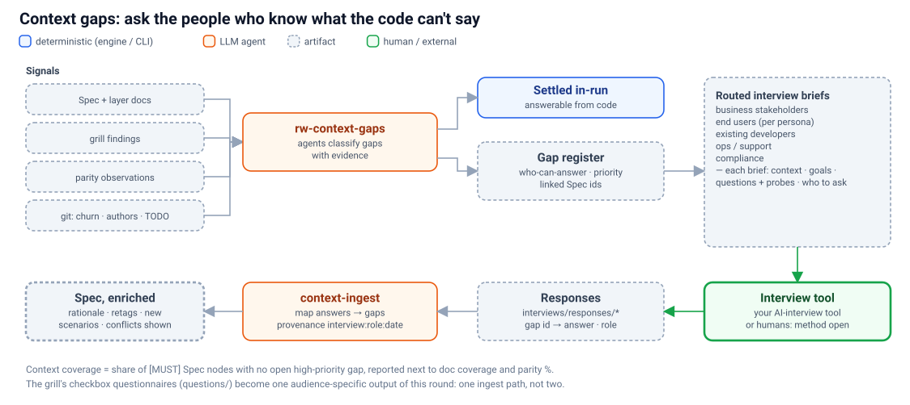

# 05b · Context gaps: find what the code can't tell us, and ask the people who know

> **In short:** Once a Spec exists, an agent round sweeps it for **context gaps**: intent, usage, non-functional requirements and tribal knowledge that no amount of code reading can recover. Each gap is routed to who can answer it, packaged into **interview briefs** for stakeholders, end users, existing developers and ops, and the answers are ingested back into the Spec with provenance. *How* the interviews are conducted is deliberately left open; an external AI-interview tool plugs in through a file contract.



## 5b.1 Why

Each existing mechanism has a blind spot:
- **Coverage** proves every item is *documented*.
- **Parity** proves what the system *does* ([05](05-behaviour-parity.md)).
- **Grilling** challenges whether behaviour *should be kept*.

None of them capture **intent and lived context**, which is where rebuilds fail quietly:
- **why** a rule exists, and whether the reason still holds;
- **which features are actually used**, and which are dead weight;
- **workarounds** users rely on, including "bugs" that became features;
- **volumes, SLAs, peaks and retention**: non-functional requirements that never appear in code;
- **regulatory and contractual** drivers;
- **planned changes** the rebuild should anticipate;
- what **developers** know is fragile, and what **ops** does by hand.

## 5b.2 Where it sits

It runs after `rw-spec`, ideally after `rw-grill` and a first `rw-observe` pass, and before `pl-plan`. It can be re-run whenever the Spec changes; `uw-refresh` can trigger it for affected slices.

## 5b.3 `rw-context-gaps`: the agent round

Specialist agents sweep these inputs:
- the Spec;
- the layer docs;
- grill findings;
- parity observations;
- **git signals**: churn, authorship, age, dead code, TODO/FIXME/HACK comments, reverted commits.

Each gap they find is classified:

| Gap type | Example signal |
|---|---|
| Unexplained `[MUST]` rule | Operation with no rationale; magic threshold `10000` |
| Usage unknown | Endpoint with no tests, no observed traffic, no frontend caller |
| Observed ≠ documented | Parity recorded 400 where the docs say 422 |
| Implicit workflow | Five endpoints always called in sequence from one screen |
| Missing NFR | No timeout/retry config; no retention policy for `audit_log` |
| Integration ownership | External API called with no owner and no contract |
| Manual ops | Runbook-shaped scripts; cron entries outside the repo |
| Persona / permission | Auth roles referenced in code but not explained anywhere |

Each gap records:
- evidence (quoted code and line, like grill findings);
- the Spec node ids it would resolve;
- priority, derived from the `[MUST]` impact;
- the **who-can-answer** route: business stakeholder, end user (by persona), existing developer, ops/support, or compliance.

As in the grill, **gaps the code can answer are settled in-run**. The rest go into the **gap register** (`docs/unwind/.cache/gaps/register.json`).

## 5b.4 Interview briefs: the outbound contract

The briefs are written to `docs/unwind/interviews/briefs/<audience>/<capability>.{md,json}`: one per audience and business capability, in both a human-readable and a machine-readable form.

```markdown
# Brief · Stakeholder · Order pricing
**Context.** The current system applies a 5% discount to orders over €100 and never
combines it with coupons. (Diagram: order flow.) We are rebuilding this service.
**Goals.** Confirm which pricing rules must carry over, and why.

## Questions
1. **Why does the 5% wholesale discount exist?** *(gap G-014 · operation:…:applyDiscount)*
   - Intent: is this contractual, promotional, or historical?
   - Probe: is €100 still the right threshold? Who could change it?
2. **Should discounts ever stack with coupons?** *(gap G-015)*
   - Intent: the code forbids it, but support tickets suggest customers expect it.

**Suggested interviewees:** Head of Sales; wholesale account manager.
```

The JSON form carries the same content plus:
- `gapIds` and `specNodeIds`;
- the question intent and follow-up probes;
- suggested interviewees: derived from git authorship for developers and from personas for end users, but **never contacting anyone automatically**.

The format is designed so an **external AI-interview tool** can run a rich, adaptive interview from it, while staying simple enough for a human interviewer.

## 5b.5 Responses and ingest: the inbound contract

- **In:** `docs/unwind/interviews/responses/*`, holding transcripts or structured answers in whatever format the interview tool produces.
- **Adapter contract** (small and tool-specific), mapping each answer to `{ gapId, answer, confidence, intervieweeRole, date, quote? }`.
- **Ingest** (`unwind rewind context-ingest`): an agent applies the answers. It can:
  - add a **rationale** to rules;
  - **retag priorities**, with a mandatory rationale, exactly like grill verdicts (`drop` → `[DON'T]`);
  - write a `fix-in-rebuild` correction into the doc body;
  - **create parity scenarios** from answers like "users rely on X" ([05 §5.2](05-behaviour-parity.md));
  - raise follow-up gaps.
- **Provenance.** Every change is stamped `interview:<role>:<date>`.
- **Conflicts are surfaced, never resolved silently.** Disagreements between the code, observed behaviour and interviews become new gaps or grill questions.

## 5b.6 One mechanism, not two

Today `uw-grill` writes checkbox questionnaires for domain experts into `docs/unwind/questions/`, and `grill-answers.mjs` ingests the ticks. In the destination design, those questionnaires become **one audience-specific output** of the context-gap round: a "domain expert, checkbox format" brief. They use the same register, the same ingest path and the same provenance. The grill keeps its job of *finding* hotspots; the context-gap round owns *asking people*.

## 5b.7 Context coverage

**Context coverage** is the share of `[MUST]` Spec nodes with no open high-priority gap. It is reported alongside:
- documentation coverage (`verify-coverage`);
- structural completeness and behavioural parity (`verify` / `parity`).

All three together make **readiness for Play measured, not asserted**. `pl-plan` shows them up front and warns before building slices that still have open high-priority gaps.

## 5b.8 Open by design

How interviews are scheduled and conducted is deliberately left out of scope: human, AI-led, async survey, or a workshop. The **brief and response formats are the contract**. Integrating a specific tool (for example the user's own AI-interview product) is an adapter: either a file hand-off or an API push, to be decided ([07](07-open-questions.md)).
