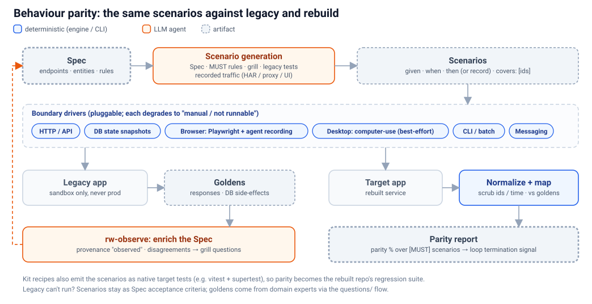

# 06 · Behaviour parity: Spec-derived tests against legacy *and* rebuild

> **In short:** Structural verification proves the rebuild *has* the right endpoints and tables. It never proves it *behaves* the same. We generate stack-neutral **scenarios** from the Spec and run them twice. Against the legacy app, the results **observe and enrich the Spec**; against the rebuild, the same scenarios give a **behavioural parity verdict**. This is characterization (golden-master) testing, driven by the Spec.



## 6.1 Why

- `rebuild-principles.md` §8 already says *present ≠ correct*. Today's verifier (`graph/rebuild-verification.ts`) checks method plus path and field names, and every other kind of node can only ever reach `present`.
- `VerificationDepth` already declares `run-tests` (`graph/rebuild-state-schema.ts:31`), but nothing implements it.
- Running tests against the **legacy** app has a second payoff. It turns *inferred* behaviour into *observed* behaviour:
  - real response shapes;
  - validation messages;
  - edge cases;
  - confirmation or refutation of grill hypotheses.

## 6.2 Scenarios

A **scenario** is a new Spec node kind. It is stack-neutral and lives in the Spec.

```yaml
id: scenario:orders:discount-threshold
covers: [endpoint:src/routes/orders.ts:POST /api/orders, operation:src/services/orders.ts:applyDiscount]
priority: MUST
source: generated            # generated | legacy-test | grill | traffic | interview | expert | fresh
given:
  db:
    customers: [{ id: c1, tier: wholesale }]
  auth: { as: customer, id: c1 }
when:
  http: { method: POST, path: /api/orders, json: { customerId: c1, items: [{ sku: A, qty: 3, priceCents: 4000 }] } }
then:
  status: 201
  json:
    totalCents: 11400          # 12000 − 5%
    status: pending
  db:
    orders: { count: +1 }
record: false                # true = expected unknown; capture from legacy as golden
```

- **`covers`** links scenarios to Spec node ids. Behavioural coverage is computed with the same set arithmetic as documentation coverage: `[MUST]` nodes minus nodes covered by a passing scenario.
- **Sources:**
  1. **Generated from the Spec**: per endpoint and entity (happy path, validation failure, auth failure, not-found, pagination), and per `[MUST]` operation.
  2. **Mined from legacy tests.** The `uw-analyze-*-tests` layers already catalogue them; we translate their intent into scenarios.
  3. **Grill findings**: each suspected bug or edge case becomes a probe.
  4. **Captured traffic**: HAR files, proxy logs and recorded UI sessions, scrubbed (§6.4).
  5. **Interviews and experts**: "users rely on X" ([07](07-context-gaps.md)).
  6. **Fresh inputs** (`source: fresh`): at least 10 inputs per slice that the builder never saw, whose outputs differ from every development case. They are held out until verification, so parity can't be met only on scenarios the builder had in view. *Borrowed from code-modernization, see [01b §1b.8](01b-compare-code-modernization.md) #2.*

## 6.3 Boundary drivers

Drivers are pluggable. When a driver cannot run, the scenario is still kept and marked `manual / not runnable`.

| Driver | Mechanism | Difficulty | Order |
|---|---|---|---|
| **HTTP / API** | fetch-based runner; JSON/body/status/header assertions | Low | 1st |
| **DB state** | Seed fixtures plus before/after table snapshots; assert side effects, not just responses | Low–Med | 1st |
| **CLI / batch / files** | Inputs → stdout, exit code and output files vs goldens | Low | 2nd |
| **Messaging** | Publish/consume against a local broker; assert emitted events | Med | 2nd |
| **Web UI** | **Playwright** (Apache-2.0) for replay. Agent-driven browser use (Chrome DevTools MCP / Claude in Chrome) to *explore and record*, then frozen into a deterministic Playwright script | Med–High | 3rd |
| **Desktop / legacy GUI** | Agent computer-use to explore and record, plus OS accessibility automation (e.g. Windows UI Automation) for replay | High (best-effort) | 4th |

Exploration by agents is non-deterministic, but **replay must be deterministic**. Recorded sessions are therefore converted into scripted scenarios before they count toward parity.

## 6.4 Normalisation and intentional differences

- **Scrubbers** for nondeterminism: generated ids, timestamps, ordering of unordered collections, tokens and nonces. Each scrubber is declared per scenario or globally.
- **A mapping layer** for intentional differences, reusing the structural verifier's equivalence rules:
  - path-parameter normalisation (`normalizeEndpointPath`);
  - field-name normalisation (`norm`);
  - target conventions from the Kit (e.g. error envelope, status 422 vs 400).
- **Every mask and tolerance carries a `why`.** Numeric tolerances have a ceiling (e.g. refuse anything looser than 1% relative). Any remaining difference becomes parity-green only through an `approvedDifference` with a reason and a named approver, recorded in the Spec. Nothing is normalised silently. *Borrowed from code-modernization ([01b §1b.8](01b-compare-code-modernization.md) #5).*
- **Verdict-aware.** `[DON'T]` items are excluded. `fix-in-rebuild` grill verdicts *expect* the legacy result to differ; the scenario holds the corrected expectation, and legacy is recorded only as a reference.

## 6.5 Lifecycle

1. **`rw-observe`** (Rewind):
   - generate or collect scenarios;
   - run them against a **sandboxed** legacy instance;
   - record goldens where `record: true`;
   - write observations back into the Spec with provenance `observed`.

   Where an observation disagrees with the docs, a grill question or context gap is raised ([07](07-context-gaps.md)).
2. **`pl-parity`** (Play): run the same scenarios against the target, apply scrubbers and the mapping layer, and write `parity-report.json` plus `parity-gaps.md`.
3. **Verification depth `behavioural`**, which implements today's `run-tests` depth. Parity % over `[MUST]` scenarios becomes a second termination signal for loop mode, alongside structural completeness %.

## 6.6 Parity tests live on in the target

Kit recipes (e.g. `endpoint-parity-test` in [04 §4.4](04-target-kits-and-recipes.md)) can emit scenarios as **native tests in the target stack**, for example vitest plus Hono's test client. The parity suite then stays in the rebuilt repo as its permanent regression suite, owned by the team, and needs no Unwind at runtime.

## 6.7 Safety and limits

- **Never run against production.** `rw-observe` requires an explicit legacy base URL or connection, plus a sandbox confirmation.
- **Read-only first.** Scenarios that change state run only against disposable or seeded environments (a Docker recipe, a snapshot restore).
- **Secrets and personal data.** Captured traffic is scrubbed before it is stored. Goldens never contain credentials.
- **When the legacy app can't run at all:**
  - scenarios still exist as Spec-level **acceptance criteria**;
  - expected results come from domain experts via the questionnaire flow (`docs/unwind/questions/`, see [07](07-context-gaps.md));
  - they run against the target only.
- **Not a proof.** Parity covers the scenarios that exist. Behavioural coverage (§6.2) makes the uncovered remainder visible rather than implied.

## 6.8 Proof discipline: making parity hard to game

*Borrowed from code-modernization's `compare.py` / `proof_pack.py` ([01b §1b.5](01b-compare-code-modernization.md), borrow list #1–#4). Unwind adapts these checks to anchor ids and slices.*

- **The checker must be able to fail.**
  - A **comparator self-check** flips bytes in a recorded golden and confirms that the scrubbers and the mapping layer still report a difference.
  - A **canary** mutates one line of generated target code and confirms the parity suite goes red.
  - If either check passes when it should fail, the run is invalid.
- **Zero executed, or skipped, is a failure.** A scenario that cannot run is never counted as a pass. Counts come **only from parsed runner output** (JUnit XML or the runner's JSON report) newer than the code under test. Counts the agent reports itself are ignored.
- **Rule → test trace states**, keyed by anchor ids. Generated and hand-written tests carry the Spec node id in their name, e.g. `[operation:src/services/orders.ts:applyDiscount] discount at threshold`. Every `[MUST]` node gets one of five states:
  - `tested`: a test ran and passed;
  - `named-not-run`;
  - `code-only`;
  - `claimed`;
  - `none`.

  Only `tested` counts toward behavioural coverage. This lands in `graph/rebuild-verification.ts`, next to the structural verdicts.
- **A computed verdict per slice:**
  - **PROVEN**: every `[MUST]` scenario passes against both legacy and target, fresh inputs included, and the canary and self-check behave.
  - **PARTLY PROVEN**: the same, except the legacy system can't run here, so the evidence is target-only or expert-supplied. This is the ceiling without a runnable legacy.
  - **NOT PROVEN**: anything else.

  The verdict is written to `rebuild-verification-graph.json` and shown on the server's slice board ([03 §3.7](03-server-and-slices.md)). A person signs off on it; a model never does.

