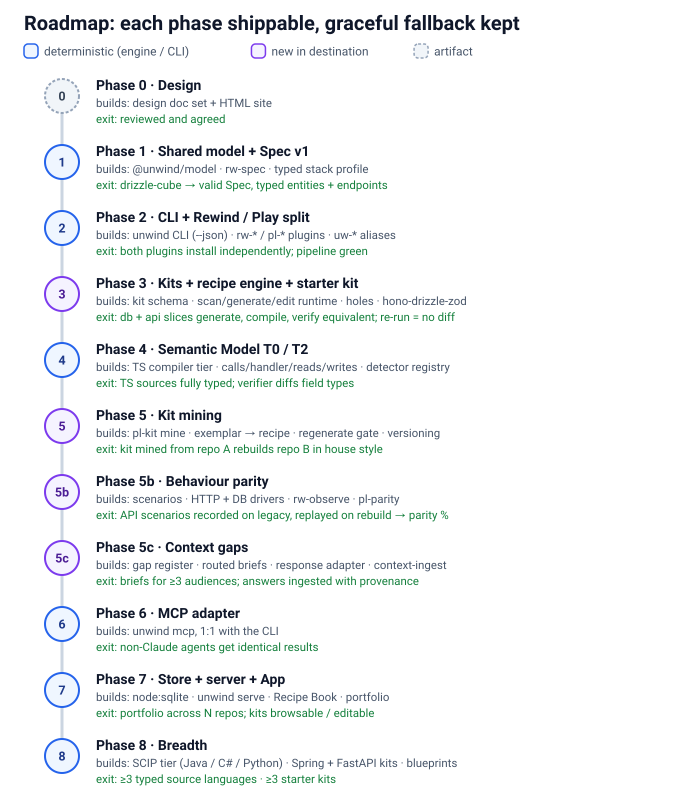

# 08 · Roadmap

> **In short:** Nine phases from today's `uw-*` plugin to the destination. Each phase is shippable on its own, keeps the graceful fallback to today's flow, and has a testable exit criterion, proven on the drizzle-cube example where possible. The order delivers value early: Spec first, then the CLI, the **shared server MVP** (team use on large codebases, slices as first-class) and the split, then deterministic generation, then richer semantics, mining, behaviour, context and slice convergence, then surfaces.



## 8.1 Phases

| Phase | Steps | Exit criteria |
|---|---|---|
| **0. Design** | This document set and the HTML site. | Reviewed and agreed. |
| **1. Shared model + Spec v1** | Extract `@unwind/model` from `packages/core` (ids, schemas). Define Spec v1 ([02 §2.5](02-architecture.md)). Add `rw-spec`, compiling the Spec from manifest + graph + tagged docs, with fenced DDL/JSON-Schema/OpenAPI parsed by real parsers. Add a typed stack profile written by the plan interview, replacing the API-style regex in `skills/scripts/verify-rebuild.mjs`. **Rule-card shape** for `operation` nodes and an **`INTENT` record** captured once; citation referee on every `[MUST]` ([01b](01b-compare-code-modernization.md) #6, #7, #9). | drizzle-cube produces a valid Spec with typed entities and endpoints. |
| **2. CLI + Server MVP + Rewind/Play split** | Consolidate `skills/scripts/*.mjs` into the `unwind` CLI (`@unwind/engine` + `@unwind/cli`, `--json` everywhere); turn the scripts into shims. **Server MVP** ([03](03-server-and-slices.md)): `unwind serve` (Hono + node:sqlite + system git, one Docker image); bearer-token auth (`login` / `whoami` / `logout`); projects; `push` / `pull` / `status` with optimistic concurrency and secret scrubbing; **slices** (propose from the import graph, claim, state machine, per-slice coverage); basic UI (projects, slice board, slice detail with `DocsViewer`, graph coloured by slice, activity, tokens). Two plugins in one repo; `rw-*` / `pl-*` skills; `uw-*` aliases; manifests and marketplace updated. Play reads the Spec, plus docs for semantics. **From [01b](01b-compare-code-modernization.md):** `rw-start` preflight (human questions, toolchain proof, inbound-consumer scope check), `unwind status` with staleness + exact next command, untrusted-content discipline in every agent prompt, secrets quarantine before `uw-publish` and push, machine-parsed plan phases, explicit fan-out coverage gaps and resumable runs (#8, #11–#13, #15, #16). | Both plugins install independently, and the pipeline passes on drizzle-cube offline. Two users push the drizzle-cube analysis as ≥ 3 slices to one Docker server and see it on the slice board; a concurrent push to a different slice does not conflict, and a push touching the same path returns 409 and succeeds after pull. |
| **3. Kit format + recipe engine + starter kit** | Kit schema and loader with `extends`; recipe runtime (scan / generate / edit, idempotent apply, hole protection); blueprint composer; golden-fixture runner (`kit test`); `hono-drizzle-zod` starter kit; `pl-build` runs generate → holes → LLM → verify; the verifier counts holes and checks types; the scaffold recipe sets `config.scaffolded`. The first slice is a **pilot** that writes a playbook (kit delta) ([01b](01b-compare-code-modernization.md) #10). | drizzle-cube's database and API slices generate, compile and verify `equivalent`. Re-runs give no diff. |
| **4. Semantic Model T0/T2** | TS compiler-API tier; tree-sitter type and route-prefix extraction; `calls`/`reads`/`writes`/`derives_from` edges; handler binding; per-file `semanticTier`; detector-recipe registry refactor of `contract-detectors.ts`. | Spec entities and endpoints are fully typed for TS sources. The verifier diffs field types. |
| **5. Kit mining** | `play kit mine` (profile, conventions, type map); exemplar selection; LLM parameterisation behind the regenerate gate; kit versioning and pinning; in-flight promotion. | A kit mined from one reference repo rebuilds another repo's slice in that house style. |
| **5b. Behaviour parity** | Scenario schema in the Spec; generation from Spec + legacy tests + grill findings; HTTP + DB-state drivers first; scrubbers and mapping layer; `rw-observe` (record goldens, enrich the Spec with provenance); `pl-parity` and the `behavioural` verification depth; kit recipes emit native target tests. **Proof discipline** ([06 §6.8](06-behaviour-parity.md), [01b](01b-compare-code-modernization.md) #1–#5): comparator self-check, canary, zero-executed = fail, counts from parsed runner output only, `source: fresh` scenarios, masks with `why` + approved differences, rule→test trace states, PROVEN / PARTLY / NOT verdict per slice. Then browser (Playwright plus agent recording), CLI/batch and messaging drivers; desktop is best-effort. | drizzle-cube's API scenarios are recorded against the legacy app and replayed against the rebuild, with a parity % over `[MUST]` scenarios. |
| **5d. Slice convergence + Play by slice** | Slice Spec fragments merged into `spec/project.spec.json` on push; uncovered / overlaps / conflicts / seams report and resolve UI; convergence % metric; seams as interface contracts plus parity scenarios; Play slice states (`planned → generating → filling → verified → cut-over`); seam graph drives the strangler-style build order; legacy adapters for unsatisfied seams. Dependency-gated batch fan-out with a 2/3 circuit breaker and playbook gap folding ([01b](01b-compare-code-modernization.md) #10). | drizzle-cube reaches 100% convergence across its slices; one slice is rebuilt and verified on its own, with its seams to unrebuilt slices satisfied by adapters. |
| **5c. Context gaps** | Gap taxonomy and register schema; `rw-context-gaps` agent round; audience routing; brief format (md + json); response adapter contract plus `context-ingest`; provenance on Spec nodes; grill questionnaires folded in; context-coverage metric. Two-judge `[MUST]` panel on hotspots; split verdicts become context gaps ([01b](01b-compare-code-modernization.md) #6). The external interview tool is an adapter, not core. | drizzle-cube produces routed briefs for ≥ 3 audiences, and a sample response set ingests back into the Spec with provenance. |
| **6. MCP adapter** | `unwind mcp`: a stdio MCP server whose tools map 1:1 onto CLI commands and server API routes, with no separate logic. The skills keep using the CLI. | Non-Claude-Code agents can drive Rewind/Play with results identical to the CLI. |
| **7. App depth + portfolio** | Server UI grows: metrics over time, convergence and conflict resolution UX, questions and interview briefs answered in place, FTS search, multi-project portfolio, Recipe Book and Kit browser, kit editor, optional mirror push of artifacts to GitHub/GitLab. | A portfolio view across N projects; kits browsable and editable in the App; questions answered in the UI land as commits. |
| **8. Breadth** | SCIP tier for Java/C#/Python; starter kits for Spring/JPA and FastAPI/SQLAlchemy; blueprints for event consumers, scheduled jobs and BFFs; more parity drivers; import ecosystem graphs (jdeps / madge / `cargo metadata`) for grammar-less languages; X-ray read hook ([01b](01b-compare-code-modernization.md) #14, #17). | ≥ 3 source languages typed, and ≥ 3 starter kits. |

## 8.2 Dependencies

```
0 ─► 1 ─► 2 ─► 3 ─► 5 (mining needs the recipe engine)
          │    ├──► 5b (parity uses the Spec; native tests use kits)
          │    └──► 5d (convergence needs server slices (2) + Spec; Play-by-slice needs 3)
          ├──► 4 (can start after 1; strengthens 3's verification and seam detection)
          └──► 5c (needs the Spec; better after 5b observations)
2 ─► 6 ─► 7 ─► 8
```

Phases 4, 5b, 5c and 5d can run in parallel with 3 once the Spec exists. Phase 8 is open-ended.

## 8.3 Cross-cutting rules for every phase

- **Graceful fallback.** If the new path is unavailable (no kit match, no TS compiler, no runnable legacy app, no server), the previous behaviour runs and the skill says so.
- **Additive schemas.** Optional fields only. The `schemaVersion` bumps and migrations are documented in `@unwind/model`.
- **AST over regex** for every new detector and every target edit.
- **Tests next to the source** (`node --test`, as in `packages/core/src/**/*.test.ts`). Every recipe and detector ships with fixtures.
- **Docs move with the code.** `CLAUDE.md`, the README and the principle files (`skills/analysis-principles.md`, `skills/rebuild-principles.md`) are updated in the same phase. In particular, `rebuild-principles.md` gains sections on holes, the Spec and kits.

## 8.4 Files most affected (for orientation)

| Today | Becomes |
|---|---|
| `packages/core/src/manifest/{manifest-schema.ts, candidates.ts}` | `@unwind/model` |
| `packages/core/src/layers/contract-detectors.ts` | Detector-recipe registry |
| `packages/core/src/structure/tree-sitter-plugin.ts` | T0 tier plus the T2 hook |
| `packages/core/src/graph/{build-graph.ts, rebuild-verification.ts, rebuild-state-schema.ts}` | New edges; hole, type and behavioural verdicts; kit pin; `scaffolded` used |
| `skills/uw-plan`, `skills/uw-build`, `skills/uw-build-layer` | `pl-plan`, `pl-build`, `pl-build-layer` (Kit-aware) |
| `skills/scripts/*.mjs` | `unwind` CLI subcommands (with shims) |
| `skills/uw-grill` questionnaires | One output of `rw-context-gaps` |
| `packages/dashboard` | `@unwind/app`: the server UI (served by `unwind serve`) |
| (new) | `@unwind/server`: Hono API, git + node:sqlite storage, auth, slices, convergence |
