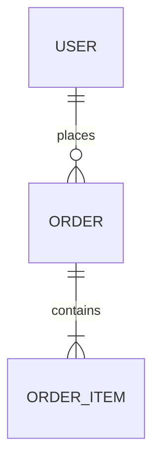

# Analysis Principles

All Unwind analysis skills follow these principles.

> **Deterministic ground truth.** When `@unwind/core` is available, a scan
> produces `docs/unwind/.cache/scan-manifest.json` — the verifiable inventory of
> files and structural symbols. Layer specialists are *seeded* from it
> (principle 16) and completeness is *checked* against it (principle 17). These
> principles describe the ideal output; the manifest makes "complete" provable
> rather than asserted. If the core is unavailable, the same principles apply but
> are enforced by the LLM (see **Graceful Degradation** at the end).

## 1. Completeness

Document **everything**. If there are 30 tables, document all 30. If there are 50 services, document all 50.

The count is not a guess: it comes from the scan manifest (`stats.byLayer`,
`layerIndex[layer]`, and per-file `symbols`). Each layer specialist receives a
**seed list** of candidate items (principle 16) and must cover every one. The
deterministic verifier (principle 17) then proves nothing was missed.

All documentation uses folder structure (see principle 6) to handle completeness without hitting size limits.

## 2. Machine-Readable Formats

Prefer actual definitions over markdown recreation:

**Do:**
```sql
CREATE TABLE users (
    id BIGINT PRIMARY KEY,
    email VARCHAR(255) NOT NULL UNIQUE,
    created_at TIMESTAMP DEFAULT NOW()
);
```

**Don't:**
| Column | Type | Nullable | Description |
|--------|------|----------|-------------|
| id | BIGINT | NO | Primary key |

**Do:**


**Don't:**
- Users have many Orders (1:N)
- Orders have many OrderItems (1:N)

## 3. Link to Source

**Use the `link_format` from `docs/unwind/architecture.md`** to create source links.

### Getting the Link Format

Read the `repository` section from `docs/unwind/architecture.md`:
```yaml
repository:
  type: github
  url: https://github.com/owner/repo
  branch: main
  link_format: https://github.com/owner/repo/blob/main/{path}#L{start}-L{end}
```

### Creating Links

Replace placeholders in `link_format`:
- `{path}` → file path from project root (e.g., `src/service/UserService.java`)
- `{start}` → start line number
- `{end}` → end line number

**Example with GitHub repo:**
```
link_format: https://github.com/acme/api/blob/main/{path}#L{start}-L{end}

Result: [UserService.java](https://github.com/acme/api/blob/main/src/service/UserService.java#L45-L67)
```

**Example with local repo (no remote):**
```
link_format: {path}:{start}-{end}

Result: src/service/UserService.java:45-67
```

### Important

- **Always read `architecture.md` first** to get the actual link format
- **Never hardcode** `owner/repo` - use the discovered values
- If `architecture.md` doesn't exist yet, use local format: `path:line-line`

## 4. No Commentary

**Do:**
- State what exists
- Document actual behavior
- List concrete facts

**Don't:**
- "This could be improved by..."
- "It appears that..."
- "This might be used for..."
- "Consider adding..."
- Recommendations or suggestions
- Speculation about intent

## 5. No Assumptions

Document only what is verifiable in code:

**Do:**
```
UserService.createUser() calls UserRepository.save()
```

**Don't:**
```
UserService.createUser() probably validates email first
```

If something is unclear, mark it as unknown:
```
## Unknowns
- Purpose of `legacy_flag` field in users table
```

## 6. Document Structure (Mandatory Folder Format)

**Always** use folder structure for every layer - never a single file:

```
docs/unwind/layers/{layer}/
├── index.md           # Overview, counts, links to all sections
├── {section-1}.md     # Content-type sections (e.g., schema.md, services.md)
├── {section-2}.md
└── {domain-n}.md      # Domain splits for large layers (e.g., users.md, orders.md)
```

**Organization strategy:**
- **Small layers (< 20 items):** Split by content type (schema.md, repositories.md)
- **Large layers (20+ items):** Split by domain/module (users.md, orders.md)
- **index.md is mandatory:** Links to all sections, provides aggregate counts

The folder structure ensures:
- Smaller files that fit within token limits
- Incremental writes are possible (see principle 14)
- Easier verification and synthesis

## 7. Code Over Prose

When documenting behavior, include actual code:

**Do:**
```java
// UserService.java:45-52
@Transactional
public User createUser(CreateUserRequest req) {
    User user = new User(req.email(), passwordEncoder.encode(req.password()));
    return userRepository.save(user);
}
```

**Don't:**
```
The createUser method takes a request, creates a User entity,
encodes the password, and saves it to the repository.
```

## 8. Schema Definitions

For data structures, include actual definitions:

**Database:** Include DDL or migration SQL
**API:** Include OpenAPI/GraphQL schema snippets
**Events:** Include event schema (JSON Schema, Avro, Protobuf)
**DTOs:** Include actual class/type definitions

## 9. Rebuild Categorization [MANDATORY]

**EVERY documented item MUST have a tag in its heading.** No exceptions.

The target audience is an AI agent that will rebuild the system. Tags tell it what to prioritize.

### Tag Format

Put the tag at the end of every markdown heading for tables, functions, entities, endpoints, etc:

```markdown
### users table [MUST]
### GetUserByEmail [MUST]
### cache_config [SHOULD]
### drizzle_query_pattern [DON'T]
```

### Tag Meanings

| Tag | Meaning | Examples |
|-----|---------|----------|
| **[MUST]** | Essential - rebuild fails without this | Tables, core functions, business logic, API contracts |
| **[SHOULD]** | Valuable pattern but could differ | Caching, logging, helper utilities, test helpers |
| **[DON'T]** | Tech-specific - omit from rebuild | ORM syntax, CSS classes, build config |

### Default Tag

**When uncertain, use [MUST].** It's safer to include too much than miss critical functionality.

### Layer-Specific Defaults

| Layer | Default [MUST] | Default [SHOULD] | Default [DON'T] |
|-------|----------------|------------------|-----------------|
| Database | All tables, core indexes | Audit tables, performance indexes | ORM-specific syntax |
| Domain | Entities, validation rules, enums | DTOs, mappers | Framework annotations |
| Service | Business logic, calculations, formulas | Logging, caching | Framework patterns |
| API | Endpoints, auth, contracts | Error handling patterns | Middleware config |
| Frontend | User flows, state | Component patterns | CSS classes, build |

### Example

```markdown
# Database Schema

### users [MUST]
Primary user table...

### audit_logs [SHOULD]
Optional audit trail...

# Repositories

### FindUserByEmail [MUST]
Core lookup function...

### GetDBPath [SHOULD]
Test utility function...
```

## 10. Exact Counts Required

Never use approximations. Vague counts prevent verification and suggest incomplete analysis.

**Don't:**
```markdown
The system has 30+ tables including users, orders, products...
```

**Do:**
```markdown
The system has 42 tables:
1. users
2. orders
3. products
[... all 42 listed]
```

**Why this matters:** An AI rebuild agent cannot verify completeness against "30+" but can verify against "42". With the scan manifest, "42" is the deterministic count from `stats`/`layerIndex` — and the coverage verifier (principle 17) proves all 42 are documented.

## 11. Complex Field Schemas

For JSONB, JSON, or any complex/nested field types, document the internal structure:

**Process:**
1. Search for TypeScript interfaces or type definitions
2. Search for Zod/Yup validation schemas that define the structure
3. Examine actual usage in code to infer structure
4. If structure is implicit, document from usage patterns

**Example:**
```markdown
### snapshotCalculations.calculationData [MUST]

**Type:** JSONB

**Structure:**
```typescript
{
  periodIntervals: number;    // From periods[rate.interval]
  intervalType: string;       // 'hour' | 'day' | 'week' | 'month'
  intervalRate: number;       // Rate value used
  rateSource: string;         // 'specific' | 'supplier-default' | 'missing'
  fteBasis: number;           // 0-2 range
  allocation: number;         // 0-100 percentage
  total: number;              // Calculated cost
  capexPercentage: number;    // 0-100
  totalCapex: number;         // total * capexPercentage / 100
  totalOpex: number;          // total - totalCapex
}
```

**Source:** Inferred from `snapshot-operations.ts:180-195`
```

## 12. Hardcoded Constants

Document all magic numbers and hardcoded values that affect business logic:

**Example:**
```markdown
### Constants [MUST]

| Constant | Value | Location | Usage |
|----------|-------|----------|-------|
| hoursPerDay | 8 | builder.ts:185 | Hours calculation assumes 8-hour workday |
| daysInYear | 365 | builder.ts:208 | Yearly rate proration |
| weekDivisor | 5 | builder.ts:201 | Weeks = Math.ceil(workingDays / 5) |
```

## 13. Edge Cases and Conditional Logic

Document where behavior varies based on conditions:

**Example:**
```markdown
### Rate Interval Edge Cases [MUST]

| Interval | Formula | Note |
|----------|---------|------|
| hours | workingDays * 8 * rate * fte * allocation | Uses hoursPerDay constant |
| days | workingDays * rate * fte * allocation | Standard calculation |
| weeks | Math.ceil(workingDays/5) * rate * fte * allocation | Rounds up partial weeks |
| months | rate * fte * allocation | **NO period multiplier** |
| years | (workingDays/365) * rate * fte * allocation | Prorates by working days |

**Source:** `builder.ts:193-215`
```

## 14. Incremental Writing

**Write each section file immediately after analyzing it.** Do not buffer all analysis and write at the end.

**Process:**
1. Create the layer folder: `docs/unwind/layers/{layer}/`
2. Create `index.md` with header and empty sections list
3. After analyzing each section:
   - Write the section file immediately (e.g., `schema.md`)
   - Update `index.md` to add link to the new section
4. Finalize `index.md` with counts and summary

**Why this matters:**
- Large codebases may exhaust token budget before a single large write
- Incremental writes ensure partial progress is saved
- Smaller files are more reliable to write

**Example incremental flow for database layer:**
```
1. mkdir docs/unwind/layers/database/
2. Write index.md (skeleton)
3. Analyze tables → Write schema.md → Update index.md
4. Analyze repos → Write repositories.md → Update index.md
5. Analyze JSONB → Write jsonb-schemas.md → Update index.md
6. Finalize index.md with counts
```

## 15. Migrations: Current State Only

For database migrations, document only the **current schema state**, not migration history.

**Do:**
```markdown
## Migrations

**Location:** `src/db/migrations/`

The current schema state (result of all migrations) is documented in `schema.md`.
```

**Don't:**
```markdown
## Migrations

### 001_create_users.sql
Creates users table with id, email, password...

### 002_add_status.sql
Adds status column to users...

### 003_add_index.sql
...
```

**Why:** Migration history is for version control, not rebuild. AI rebuild agents need the final schema, not the journey.

## 16. Manifest Seeding [MANDATORY when scan available]

Layer specialists do not start from a blank page. Each is dispatched with its
**seed list** — `docs/unwind/.cache/seeds/{layer}.json`, the deterministic set of
candidate items (id, kind, name, file, line range, source link) the scanner found
for that layer.

**Rules:**
- **Cover every seeded item.** The seed is a checklist; documenting all of it is
  the floor, not the ceiling.
- **Never silently drop an item.** To omit a seeded item from the rebuild,
  document it under an `## Excluded` section with a one-line reason. Dropping it
  silently will surface as a coverage gap (principle 17).
- **You may add items.** The scanner can miss things (dynamically-registered
  routes, reflection, generated code). Add them with the same heading format.

## 17. Anchor-ID Headings [MANDATORY when scan available]

Every documented item heading carries a stable anchor id matching its manifest
candidate id, so completeness can be verified mechanically (set arithmetic, not
LLM judgement).

**Format** — the `[MUST]/[SHOULD]/[DON'T]` tag (principle 9) plus an id comment:

```markdown
### users [MUST] <!-- id: table:src/db/schema.ts:users -->
### GetUserByEmail [MUST] <!-- id: function:src/repo/users.ts:GetUserByEmail -->
### GET /users [MUST] <!-- id: endpoint:src/api/users.ts:GET /users -->
```

The `id` is the item's `id` from the seed list, copied verbatim. The verifier
(`verify-coverage.mjs`) matches documented items to candidates by id first, then
falls back to a fuzzy name match — so anchor ids are strongly preferred (they
make coverage exact and reproducible). Item headings are `###` or deeper; `#`/`##`
are layer/section titles and are not treated as items.

## Graceful Degradation

The deterministic engine (`@unwind/core`) is an **enhancement, not a hard
dependency**. If Node/pnpm or the built core are unavailable:
- `uw-scan` falls back to pure-LLM Explore discovery.
- `uw-analyze` dispatches specialists without seed lists.
- `uw-verify` falls back to a subjective doc-vs-source
  comparison.
- Principles 16-17 cannot be enforced mechanically; the LLM applies completeness
  (principles 1, 10) by judgement instead.

When running in fallback mode, **say so** — the output is still valid Unwind
documentation, but completeness is asserted rather than proven.
