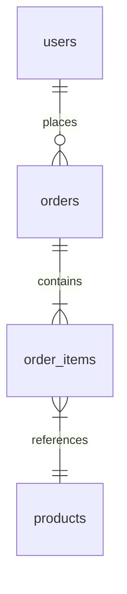

# Analyzing Database Layer

**Output:** `docs/unwind/layers/database/` (folder with index.md + section files)

**Principles:** See `analysis-principles.md` - completeness, machine-readable, link to source, no commentary, incremental writes.

## The data model is code-first; SQL is its physical contract

For a rebuild in a different stack, the **canonical data model is the code-side
representation** — the ORM models/entities (Drizzle, Prisma, TypeORM, SQLAlchemy,
Mongoose, Sequelize, JPA, EF Core). That is where the field names, types,
relations, defaults, and business rules live, and it is what the rebuild reproduces.

**Raw SQL DDL (`CREATE TABLE`, migrations) is a *contract*, not the model.** When
the deterministic scan finds a code-side model, it makes that the canonical `table`
candidate and **reconciles matching SQL DDL onto it** (demoting the migration's
`CREATE TABLE` to a `db-ddl` contract linked via `dataModelLinks`). So:

- **Lead with the code-side entity.** Document each entity once, under its code
  anchor id (`table:<code-path>:<Name>`). Describe fields, types, relations, and the
  invariants/business rules they encode.
- **Attach SQL DDL as the physical contract** *beneath* its entity — the on-disk
  schema the rebuild must preserve. Do **not** create a separate heading per
  migration's `CREATE TABLE`; reconciliation already folded those into the entity,
  and coverage no longer counts them.
- **SQL-first projects (no ORM) are unchanged.** When there is no code-side model,
  unmatched SQL tables stay canonical `table` candidates — document them from the
  DDL as before.

**Graceful fallback:** if `@unwind/core` / seeds are unavailable (no
`docs/unwind/.cache/seeds/database.json`), fall back to the legacy SQL-first flow —
extract tables from migrations/DDL directly — and say so in `index.md`.

## Output Structure

```
docs/unwind/layers/database/
├── index.md           # Overview, entity count, ER diagram, links to sections
├── data-model.md      # CANONICAL: code-side entities (fields, types, relations, rules)
├── schema.md          # Physical SQL DDL contract per entity (the on-disk schema)
├── repositories.md    # Data access patterns, queries
└── jsonb-schemas.md   # Complex field type definitions (if any JSONB/JSON columns)
```

For large codebases (20+ entities), split `data-model.md` by domain:
```
docs/unwind/layers/database/
├── index.md
├── users-domain.md    # User, UserSettings, UserRole entities (+ their DDL)
├── orders-domain.md   # Order, OrderItem, Shipment entities (+ their DDL)
└── ...
```

## Process (Incremental Writes)

**Step 1: Setup**
```bash
mkdir -p docs/unwind/layers/database/
```
Write initial `index.md`:
```markdown
# Database Layer

## Sections
- [Data Model](data-model.md) - _pending_
- [Physical Schema](schema.md) - _pending_
- [Repositories](repositories.md) - _pending_
- [JSONB Schemas](jsonb-schemas.md) - _pending_

## Summary
_Analysis in progress..._
```

**Step 2: Analyze and write data-model.md (the canonical model)**
1. Read `docs/unwind/.cache/seeds/database.json` — the seeded `table` candidates are
   the **code-side entities** (their anchor ids are `table:<code-path>:<Name>`).
2. For EACH entity, read its source and document: fields + types, relations
   (has-many / belongs-to / FK), enums, defaults, and the **business rules /
   invariants** it encodes. Use the code anchor id in the heading.
3. Write `data-model.md` immediately; update `index.md`.

**Step 3: Analyze and write schema.md (the physical contract)**
1. For each entity, find the physical DDL — prefer the reconciled SQL (`dataModelLinks`
   connects the entity's `table:` id to a `db-ddl:` migration) or generate it from the
   ORM model when there are no migrations.
2. Present the DDL **grouped under its entity**, as the contract the rebuild must
   preserve. Do not emit a separate documented heading per migration table.
3. Write `schema.md` immediately; update `index.md`.

**Step 4: Analyze and write repositories.md**
1. Find repository/DAO/query modules
2. List ALL with source links and method signatures
3. Write `repositories.md` immediately; update `index.md`

**Step 5: Analyze and write jsonb-schemas.md** (if applicable)
1. Find JSONB/JSON columns
2. Extract TypeScript interfaces or Zod schemas
3. Write `jsonb-schemas.md` immediately; update `index.md`

**Step 6: Finalize index.md**
Update with final counts and summary

## Output Format

### index.md

```markdown
# Database Layer

## Sections
- [Data Model](data-model.md) - 12 entities (code-side, canonical)
- [Physical Schema](schema.md) - DDL contract for 12 entities, 4 indexes
- [Repositories](repositories.md) - 8 repository classes
- [JSONB Schemas](jsonb-schemas.md) - 3 complex field types

## Migrations

**Location:** `src/db/migrations/`

Current schema state (result of all migrations) is documented in [schema.md](schema.md).

## Entity Relationships



## Summary
- **Tables:** 12
- **Repositories:** 8
- **JSONB columns:** 3

## Unknowns
- [List anything unclear]
```

### data-model.md (canonical)

The anchor-id heading for each `table:` candidate lives **here** — this is the
canonical model. Use the code anchor id from `seeds/database.json`.

```markdown
# Data Model

## Entities (12 total)

### User [MUST] <!-- id: table:src/db/schema.ts:users -->

Source: [schema.ts](https://github.com/owner/repo/blob/main/src/db/schema.ts#L12-L34)
ORM: Drizzle (`pgTable`). Physical table: `users`.

| Field | Type | Nullable | Default | Notes / Rule |
|-------|------|----------|---------|--------------|
| id | serial | NO | auto | PK |
| email | text | NO | - | UNIQUE; lowercased on write (see UserService) |
| organisationId | integer | NO | - | belongs-to Organisation (FK, ON DELETE CASCADE) |

**Relations:** has-many Post. **Invariants:** email unique per organisation.

[Continue for ALL entities...]
```

### schema.md (physical contract)

The on-disk schema each entity maps to — the contract the rebuild must preserve.
Group DDL **under its entity** with a plain `##` heading (no anchor id — the entity
is already documented in `data-model.md`; reconciliation folded the migration's
`CREATE TABLE` into a `db-ddl` contract, so it is not a separate coverage target).

```markdown
# Physical Schema

## users (→ User)

```sql
CREATE TABLE "users" (
    "id" serial PRIMARY KEY,
    "email" text NOT NULL UNIQUE,
    "organisation_id" integer NOT NULL REFERENCES organisation(id) ON DELETE CASCADE
);
CREATE INDEX idx_users_email ON users(email);
```

[Continue for ALL entities. For SQL-first projects with no code model, document the
table from the DDL directly, using the `table:` anchor id here instead.]
```

### repositories.md

```markdown
# Repositories

## UserRepository

[UserRepository.java](https://github.com/owner/repo/blob/main/src/repository/UserRepository.java)

```java
public interface UserRepository extends JpaRepository<User, Long> {
    Optional<User> findByEmail(String email);

    @Query("SELECT u FROM User u WHERE u.status = :status")
    List<User> findByStatus(@Param("status") UserStatus status);
}
```

[Continue for ALL repositories...]
```

## Additional Requirements

### Field-Level Documentation [MUST]

For EVERY table, document ALL of the following:
- Column name and database type (VARCHAR, INTEGER, JSONB, etc.)
- NOT NULL constraints
- DEFAULT values
- UNIQUE constraints
- Foreign key relationships with ON DELETE behavior (CASCADE, SET NULL, RESTRICT)

**Example:**
```markdown
### users table [MUST]

| Column | Type | Nullable | Default | Constraints |
|--------|------|----------|---------|-------------|
| id | SERIAL | NO | auto | PRIMARY KEY |
| email | VARCHAR(255) | NO | - | UNIQUE |
| organisation | INTEGER | NO | - | FK → organisation.id ON DELETE CASCADE |
| created_at | TIMESTAMP | NO | NOW() | - |
```

### JSONB Schema Extraction [MUST]

For every JSONB/JSON column:
1. Search for TypeScript interfaces that type this field
2. Search for Zod schemas that validate it
3. If no explicit type, infer from usage in code
4. Document the complete nested structure

**Example:**
```markdown
### calculationData (JSONB) [MUST]

**Source:** Inferred from `snapshot-operations.ts:180-195`

```typescript
{
  periodIntervals: number;
  intervalType: 'hour' | 'day' | 'week' | 'month';
  total: number;
  capexPercentage: number;  // 0-100
  totalCapex: number;
  totalOpex: number;
}
```
```

### Index Documentation [SHOULD]

Document ALL indexes with:
- Index name
- Columns covered
- Type (btree, gin, partial)
- Rationale (if apparent from naming or usage)

## Mandatory Tagging

**Every table, function, and schema must have a [MUST], [SHOULD], or [DON'T] tag in its heading.**

Default categorizations for database layer:
- **[MUST]**: All tables, core repository functions, JSONB schemas
- **[SHOULD]**: Audit/logging tables, test utilities, performance indexes
- **[DON'T]**: ORM-specific query patterns, migration-specific syntax

Example:
```markdown
### users [MUST]
### audit_logs [SHOULD]
### FindUserByEmail [MUST]
### GetTestDBPath [SHOULD]
```

See `analysis-principles.md` section 9 for full tagging rules.

## Refresh Mode

If `docs/unwind/layers/database/` exists, compare current state and add `## Changes Since Last Review` section to `index.md`.
